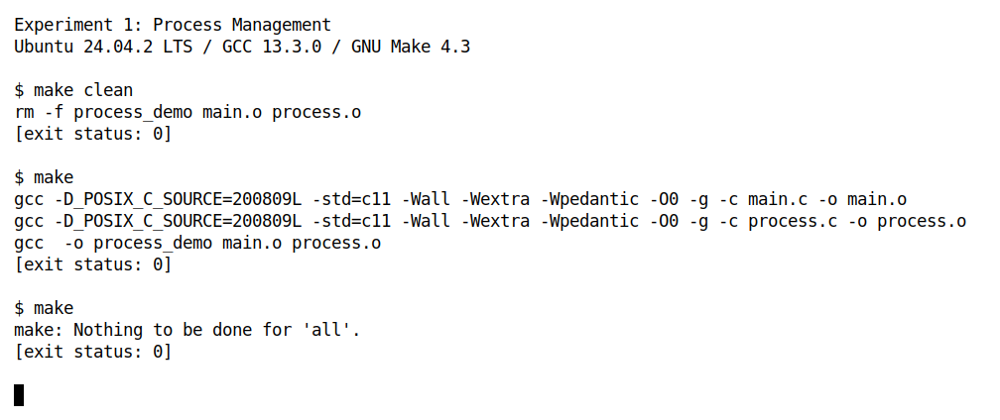
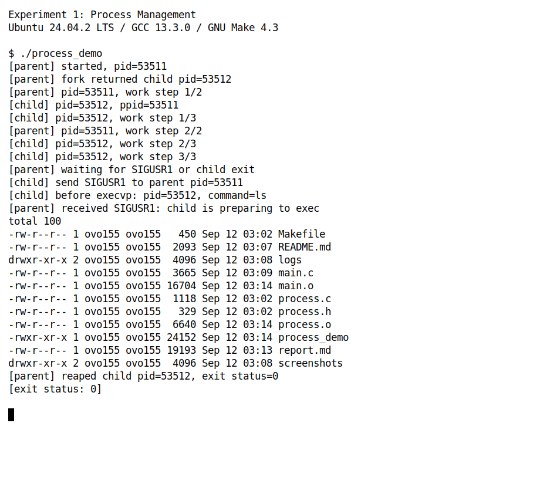
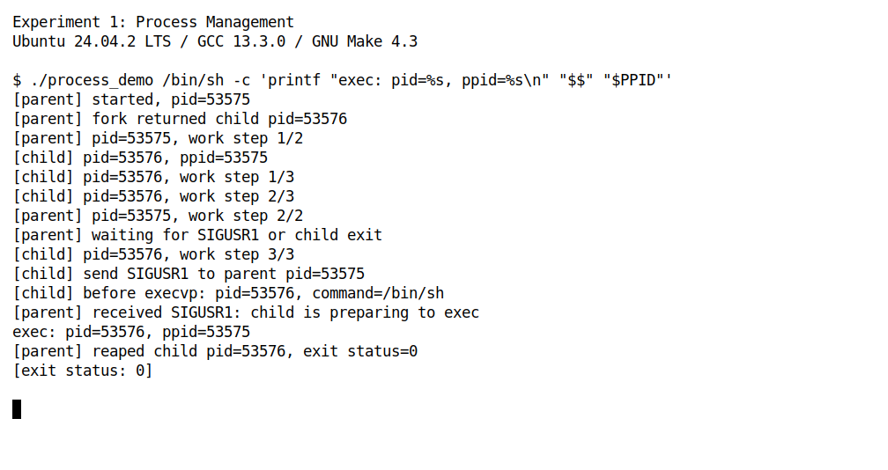
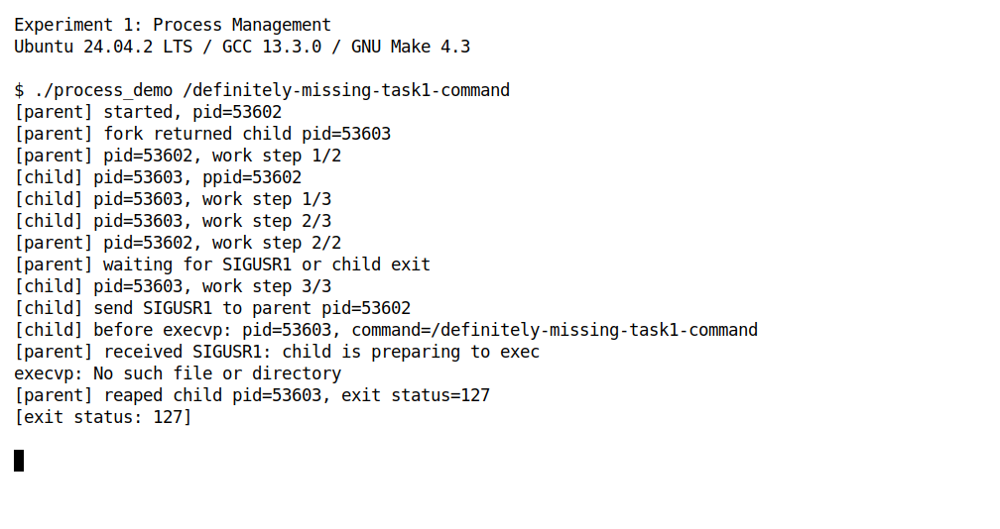

学号：待填写　　姓名：待填写　　专业：待填写　　班级：待填写

# 《Linux操作系统设计实践》实验一：进程管理

实验日期：2026 年 9 月 12 日

## 一、实验环境

| 项目 | 实际使用的环境 |
| --- | --- |
| 操作系统 | Ubuntu 24.04.2 LTS，运行于 WSL2 |
| Linux 内核 | 6.6.87.2-microsoft-standard-WSL2 |
| 体系结构 | x86_64 |
| C 编译器 | GCC 13.3.0 |
| 构建工具 | GNU Make 4.3 |
| 编译选项 | `-std=c11 -Wall -Wextra -Wpedantic -O0 -g` |
| 接口声明 | 通过 `-D_POSIX_C_SOURCE=200809L` 启用所需 POSIX 接口 |
| 运行形式 | Linux 命令行；运行结果使用 xterm 白底窗口截图 |

实验文件位于 `homework/task1`。以下编译、运行命令均在该目录执行。

## 二、实验内容

### 2.1 实验目的与要求

本实验练习 Linux 下 C 程序的多文件开发与构建，理解程序与进程的区别，观察父子进程的并发执行，掌握使用 `exec` 系列函数执行目标程序以及使用信号通知另一进程的方法。

根据实验指导书 PDF 第 3、4 页（印刷页码 1、2），编写一个同时满足四项要求的程序：

| 指导书要求 | 本程序的实现 |
| --- | --- |
| 使用 make 编译 | Makefile 分别编译 `main.c`、`process.c`，链接得到 `process_demo` |
| 使用 fork | `main.c` 中创建一个子进程，父子进程分别执行任务 |
| 使用 exec | `process.c` 中通过 `execvp` 执行指定命令，默认执行 `ls -l` |
| 使用 signal 或 sigaction | `main.c` 中用 `sigaction` 注册 `SIGUSR1` 和 `SIGCHLD` 的处理函数 |

### 2.2 程序设计思想

程序是一个由父进程管理子进程的命令执行演示器。父进程负责创建、接收通知和回收子进程；子进程先执行演示任务，再通知父进程并切换到目标命令。默认运行约 3 秒即可结束，无需键盘输入。

1. 父进程设置标准输出为行缓冲，注册信号处理函数，屏蔽 `SIGUSR1` 和 `SIGCHLD`，然后调用 `fork`。
2. `fork` 在父进程中返回子进程 PID，在子进程中返回 `0`。父进程执行 2 步任务，子进程执行 3 步任务，每一步输出本进程的 PID 并暂停约 1 秒，便于观察交错输出。
3. 父进程完成自己的任务后，用 `sigsuspend` 暂时解除上述两个信号的屏蔽并等待。子进程完成任务后，通过 `kill(parent_pid, SIGUSR1)` 通知父进程“准备执行目标命令”。
4. 子进程输出 `exec` 前的 PID，再调用 `execvp`。调用成功后，当前子进程的进程映像被目标程序替换；失败时输出错误，并返回 `127` 或 `126`。
5. 父进程收到通知后调用 `waitpid`，等待指定子进程终止，打印退出码或终止信号，并返回相应状态。若子进程在发送通知之前就退出，`SIGCHLD` 也能唤醒父进程，避免只等 `SIGUSR1` 而无法结束。

这里的 `sleep(1)` 只用于放慢演示速度，不承担同步职责。进程同步依靠信号屏蔽、`sigsuspend` 和 `waitpid`。父子进程拥有各自的地址空间，信号处理函数修改的是接收进程自己的标志变量。

### 2.3 源程序

以下为实验主程序的完整代码，与随报告提供的源文件一致。

#### （1）process.h：公共声明

```c
#ifndef PROCESS_H
#define PROCESS_H

#include <sys/types.h>

/* 父、子进程分别执行若干步任务，用来观察并发输出。 */
void do_work(const char *role, int steps);

/* 子进程通知父进程后调用 exec；仅在出错时返回退出码。 */
int run_child(pid_t parent_pid, char *const command[]);

#endif
```

#### （2）process.c：任务执行、通知与 exec

```c
#include "process.h"

#include <errno.h>
#include <signal.h>
#include <stdio.h>
#include <unistd.h>

void do_work(const char *role, int steps)
{
    for (int i = 1; i <= steps; ++i) {
        printf("[%s] pid=%ld, work step %d/%d\n",
               role, (long)getpid(), i, steps);
        sleep(1); /* 暂停一秒便于观察，不用于保证进程的执行顺序。 */
    }
}

int run_child(pid_t parent_pid, char *const command[])
{
    printf("[child] pid=%ld, ppid=%ld\n",
           (long)getpid(), (long)getppid());
    do_work("child", 3);

    /* 用符号常量表示信号，不依赖具体平台上的信号编号。 */
    printf("[child] send SIGUSR1 to parent pid=%ld\n", (long)parent_pid);
    if (kill(parent_pid, SIGUSR1) == -1) {
        perror("kill");
        return 1;
    }

    printf("[child] before execvp: pid=%ld, command=%s\n",
           (long)getpid(), command[0]);
    execvp(command[0], command);

    /* exec 成功会替换进程映像，因此只有失败时才执行这里。 */
    int saved_errno = errno;
    perror("execvp");
    return saved_errno == ENOENT ? 127 : 126;
}
```

#### （3）main.c：进程创建、信号处理与回收

```c
#include "process.h"

#include <errno.h>
#include <signal.h>
#include <stdio.h>
#include <sys/wait.h>
#include <unistd.h>

/* 信号处理函数只修改标志，避免在异步上下文中调用 printf。 */
static volatile sig_atomic_t notified = 0;
static volatile sig_atomic_t child_exited = 0;

static void handle_signal(int signo)
{
    if (signo == SIGUSR1) {
        notified = 1;
    } else if (signo == SIGCHLD) {
        child_exited = 1;
    }
}

int main(int argc, char *argv[])
{
    char *default_command[] = {"ls", "-l", NULL};
    char **command = argc > 1 ? &argv[1] : default_command;
    struct sigaction action = {0};
    sigset_t blocked, old_mask, wait_mask;
    pid_t parent_pid = getpid();
    pid_t child_pid;
    int status;

    /* fork 前启用行缓冲；每条完整记录在换行时刷新，便于保存日志。 */
    if (setvbuf(stdout, NULL, _IOLBF, 0) != 0) {
        fprintf(stderr, "Cannot enable stdout line buffering.\n");
        return 1;
    }
    action.sa_handler = handle_signal;
    sigemptyset(&action.sa_mask);
    if (sigaction(SIGUSR1, &action, NULL) == -1) {
        perror("sigaction (SIGUSR1)");
        return 1;
    }
    action.sa_flags = SA_NOCLDSTOP;
    if (sigaction(SIGCHLD, &action, NULL) == -1) {
        perror("sigaction (SIGCHLD)");
        return 1;
    }

    /* 先屏蔽再 fork，防止通知先于父进程开始等待而丢失。 */
    sigemptyset(&blocked);
    sigaddset(&blocked, SIGUSR1);
    sigaddset(&blocked, SIGCHLD);
    if (sigprocmask(SIG_BLOCK, &blocked, &old_mask) == -1) {
        perror("sigprocmask");
        return 1;
    }
    printf("[parent] started, pid=%ld\n", (long)parent_pid);
    child_pid = fork();
    if (child_pid == -1) {
        perror("fork");
        sigprocmask(SIG_SETMASK, &old_mask, NULL);
        return 1;
    }
    if (child_pid == 0) {
        /* 子进程恢复信号掩码，避免把实验临时屏蔽的信号带入 exec。 */
        if (sigprocmask(SIG_SETMASK, &old_mask, NULL) == -1) {
            perror("sigprocmask (child)");
            _exit(1);
        }
        _exit(run_child(parent_pid, command));
    }

    printf("[parent] fork returned child pid=%ld\n", (long)child_pid);
    do_work("parent", 2);
    printf("[parent] waiting for SIGUSR1 or child exit\n");
    wait_mask = old_mask;
    sigdelset(&wait_mask, SIGUSR1);
    sigdelset(&wait_mask, SIGCHLD);
    while (!notified && !child_exited) {
        /* 原子地解除屏蔽并睡眠；被处理的信号唤醒后重新检查标志。 */
        sigsuspend(&wait_mask);
    }
    if (notified) {
        printf("[parent] received SIGUSR1: child is preparing to exec\n");
    } else {
        printf("[parent] received SIGCHLD before handling SIGUSR1\n");
    }

    /* 信号通知不等于回收进程；仍需 waitpid 获取终止状态。 */
    pid_t waited;
    do {
        waited = waitpid(child_pid, &status, 0);
    } while (waited == -1 && errno == EINTR);
    if (waited == -1) {
        perror("waitpid");
        sigprocmask(SIG_SETMASK, &old_mask, NULL);
        return 1;
    }
    if (sigprocmask(SIG_SETMASK, &old_mask, NULL) == -1) {
        perror("sigprocmask (parent)");
        return 1;
    }
    if (WIFEXITED(status)) {
        int exit_code = WEXITSTATUS(status);
        printf("[parent] reaped child pid=%ld, exit status=%d\n",
               (long)child_pid, exit_code);
        return exit_code;
    }
    if (WIFSIGNALED(status)) {
        int signo = WTERMSIG(status);
        printf("[parent] reaped child pid=%ld, terminated by signal=%d\n",
               (long)child_pid, signo);
        return 128 + signo;
    }
    return 1;
}
```

#### （4）Makefile：多文件构建

```makefile
CC = gcc
CPPFLAGS += -D_POSIX_C_SOURCE=200809L
CFLAGS ?= -std=c11 -Wall -Wextra -Wpedantic -O0 -g
TARGET = process_demo
OBJECTS = main.o process.o

.PHONY: all run clean

all: $(TARGET)

$(TARGET): $(OBJECTS)
	$(CC) $(LDFLAGS) -o $@ $^ $(LDLIBS)

# 头文件变化时，依赖它的两个目标文件都需要重新编译。
%.o: %.c process.h
	$(CC) $(CPPFLAGS) $(CFLAGS) -c $< -o $@

run: $(TARGET)
	./$(TARGET)

clean:
	rm -f $(TARGET) $(OBJECTS)
```

Makefile 的配方行使用 Tab 缩进。`$@` 表示当前目标，`$<` 表示第一个依赖文件，`$^` 表示全部依赖文件。两个目标文件都依赖 `process.h`：修改该头文件会重新编译两个源文件；只修改 `process.c` 时，仅重新编译 `process.o`，再完成链接。`make clean` 仅删除目标文件和可执行文件。

### 2.4 编译与构建结果

```sh
make clean
make
make
```



图 1 中，首次 `make` 分别编译两个源文件并完成链接，未出现警告或错误；再次执行 `make` 提示 `Nothing to be done for 'all'.`，说明未修改文件时不会重复构建。

以下图片均来自本次实际运行的 xterm 白底终端窗口。图中的 `[exit status: ...]` 由采集脚本读取命令的实际返回码后打印，相当于在 Shell 中紧接着执行 `echo $?`。对应的完整输出保存在 `logs/01-build.txt` 至 `logs/04-exec-failure.txt`。

### 2.5 运行结果与分析

#### （1）默认运行：并发、信号通知与执行 ls

```sh
./process_demo
```



本次运行中，父进程 PID 为 `53511`，子进程 PID 为 `53512`。父进程中 `fork` 的返回值等于子进程打印的 PID，子进程的 PPID 等于父进程 PID，符合父子关系。

父进程的两步任务与子进程的三步任务出现交错输出，说明两个进程能够并发推进。输出的先后顺序受调度影响，不能据此断定它们在同一时刻运行于不同 CPU 核心，也不应期待每次都严格轮流输出。

子进程发送 `SIGUSR1` 后，父进程打印接收通知的信息；随后可以看到 `ls -l` 的目录列表。最后父进程回收 PID 为 `53512` 的子进程并显示 `exit status=0`，与正常完成的预期一致。目录列表反映截图时的文件状态，后续修改报告或重新编译后，文件大小和时间戳会变化。

#### （2）验证 exec 前后 PID 不变

```sh
./process_demo /bin/sh -c 'printf "exec: pid=%s, ppid=%s\n" "$$" "$PPID"'
```

外层单引号使 `$$`、`$PPID` 保留给新执行的 `/bin/sh` 展开，避免得到启动实验程序的外层 Shell 的 PID。



本次运行中，`execvp` 前打印的子进程 PID 是 `53576`，新执行的 Shell 打印 `exec: pid=53576, ppid=53575`，父进程最后也回收同一个 PID。这说明 `exec` 替换当前进程所执行的程序，但不会像 `fork` 一样再创建一个进程。

`execvp` 成功后不返回原调用位置，所以代码中的 `perror("execvp")` 及其后的返回语句没有执行。`SIGUSR1` 仅说明子进程已经准备调用 `execvp`，是否执行成功仍要结合目标程序输出和最终退出状态判断。

#### （3）验证 exec 失败及错误传播

```sh
./process_demo /definitely-missing-task1-command
echo $?
```



指定不存在的绝对路径后，`execvp` 返回 `-1`，输出 `No such file or directory`。子进程以 `127` 退出，父进程通过 `waitpid` 回收后也返回 `127`。程序没有把执行失败当作成功，也没有停留在等待状态，这一非零退出结果符合故意传入错误命令的测试预期。

#### （4）其他验证

还对退出状态、提前终止和构建依赖进行了检查，完整实际输出保存在 `logs/verification.txt`。

| 检查项目 | 方法 | 实测结果 |
| --- | --- | --- |
| 无执行权限 | 创建没有执行权限的临时文件，并将其作为目标命令 | 输出 `Permission denied`，回收子进程，返回 `126` |
| 目标命令非零退出 | 执行 `/bin/sh -c 'exit 7'` | 子进程和实验程序的退出码均为 `7` |
| 目标程序被信号终止 | 执行 `/bin/sh -c 'kill -TERM "$$"'` | 记录终止信号 `15`，实验程序返回 `143` |
| 子进程在通知前被终止 | 读取 `fork` 返回的子进程 PID，立即向该实验子进程发送 `SIGKILL` | 父进程通过 `SIGCHLD` 结束等待并回收，记录信号 `9`，返回 `137`，无挂起 |
| 优化编译下的信号处理 | 使用 `-O2 -Werror` 重新编译并执行 `/bin/true` | 编译通过，收到通知并回收子进程，返回 `0` |
| 未修改时的构建 | 执行 `make -q` | 返回 `0`，目标已是最新状态 |
| 头文件依赖 | 使用 `make -n -W process.h` 模拟头文件变化 | 计划重新编译两个目标文件并链接 |
| 单源文件依赖 | 使用 `make -n -W process.c` 模拟源文件变化 | 只计划重新编译 `process.o` 并链接 |

其中 `make -n -W` 用于检查依赖计划，不实际改写文件时间戳。`128 + 信号编号` 是本程序为被信号终止的子进程选择的返回码约定，并非直接使用 `waitpid` 返回的原始状态整数。

## 三、实验总结

### 3.1 与示例程序相比的改进

本实验参考了 `example/task1/1-1.c` 的父子进程并发输出、`1-2.c` 的 `exec` 调用、`1-3.c` 的信号通知、`1-4.c` 的 `sigaction` 用法及 `example/task1/make` 的多文件构建方式，将它们组合为一个完整的进程管理程序。

1. **整合执行流程。** 在同一次运行中完成并发任务、信号通知、执行新目标程序和进程回收，并打印 PID、PPID 和退出状态，便于将现象与原理对应起来。
2. **使用标准信号名称。** 使用 `SIGUSR1`、`SIGCHLD` 等符号常量，避免照搬示例中的数字 `16`、`17`；相同数字在不同平台上可能有不同含义。
3. **通过阻塞等待降低无效开销。** 用 `sigsuspend` 等待通知，替代示例中的空循环忙等；配合提前屏蔽信号，避免“已经检查标志、尚未进入等待”之间的竞态。
4. **保持信号处理函数简单。** 处理函数只修改 `volatile sig_atomic_t` 标志，把输出和回收放在正常控制流程中，避免在异步处理函数中调用 `printf` 等不适合的函数。
5. **检查失败并回收子进程。** 检查 `fork`、`kill`、`execvp`、`waitpid` 等调用结果，区分正常退出与信号终止；在 `waitpid` 被中断时重试，并通过 `SIGCHLD` 处理通知前的异常退出。
6. **体现增量构建。** 两个源文件分别生成目标文件，明确声明头文件依赖，并提供 `run`、`clean` 伪目标。

### 3.2 学习与应用的相关知识

**程序与进程。** 程序是保存在文件中的指令和数据，进程是程序的一次执行活动。`fork` 建立新的进程，父子进程从同一调用之后继续执行；`exec` 系列函数则替换当前进程的程序映像。本实验通过新 Shell 的 `$$` 和子进程 PID 对照，验证了这一区别。

**信号处理与同步。** 信号异步到达，通知也可能先于接收方开始等待。先屏蔽信号可以让信号保持待决，再用 `sigsuspend` 原子地解除屏蔽并等待，避免简单的“检查标志后调用 `pause`”可能造成的遗漏唤醒。`volatile sig_atomic_t` 适合保存这里由信号处理函数修改的简单标志；它并不等于通用的多线程同步机制。

**exec 与信号状态。** `exec` 会重置原来被捕获的信号的处理方式，但信号掩码会保留。因此子进程在调用目标程序之前恢复原信号掩码，避免把本实验临时屏蔽的信号带给目标程序。`execvp` 的 `p` 表示可按 `PATH` 搜索命令，`v` 表示以参数数组传递参数，数组最后一项必须为 `NULL`。

**进程回收与返回码。** 收到 `SIGCHLD` 只表示发生了相关状态变化，不等于已经回收子进程。需要通过 `waitpid` 取得状态，并用 `WIFEXITED`、`WEXITSTATUS`、`WIFSIGNALED`、`WTERMSIG` 等宏解释，不能直接把整个 `status` 当作退出码。

**构建与标准输出缓冲。** Make 根据目标和依赖的修改时间决定是否重建；编译和链接是不同步骤。C 标准输出在终端与重定向环境中的默认缓冲方式可能不同，`fork` 和 `exec` 附近的输出需要注意及时刷新，才能可靠地保存观察记录。

### 3.3 问题分析与解决方法

| 问题 | 分析与处理 | 验证情况 |
| --- | --- | --- |
| 父子进程的两条输出偶尔挤到一行 | 初次截图时使用无缓冲输出，观察到正文和换行在两进程间穿插。改为在 `fork` 前启用行缓冲，并让每条程序记录以换行结尾；换行时及时刷新，也避免完整记录滞留到 `exec` 之后 | 重新运行并检查日志，父子进程记录按完整行显示；输出顺序仍可能变化 |
| 子进程未发通知就结束，父进程可能一直等待 | 只等待 `SIGUSR1` 不足以覆盖异常退出，因此同时处理 `SIGCHLD`，并以 `waitpid` 得到的状态为准 | 在子进程通知前发送 `SIGKILL`，父进程被唤醒、回收并返回 `137` |
| 命令不存在与正常退出容易混淆 | `execvp` 失败后输出错误并使用非零退出码；父进程解析子进程状态，而不是统一返回成功 | 不存在路径返回 `127`，无执行权限返回 `126`，目标命令主动返回 `7` 时原样传播 |
| 观察到的通知与执行先后顺序不固定 | 发送信号后，父子进程继续由调度器安排；父进程打印接收通知与子进程打印 `exec` 提示之间没有固定顺序。通知内容只表示“准备执行”，不把它当作执行成功的依据 | 通过目标程序的实际输出及 `waitpid` 的最终状态确认结果 |

各项实测结果符合预期。正常命令可以完成并被回收，故意制造的执行失败和信号终止也能返回相应状态。实验把进程创建、执行映像替换、异步通知和进程回收串联起来，使这些接口各自承担的职责更加清楚。

### 3.4 参考材料

1. 《Linux操作系统设计实践》2026—2027 第一学期实验指导书，PDF 第 3、4 页（印刷页码 1、2）。
2. 本课程示例：`example/task1/1-1.c`、`1-2.c`、`1-3.c`、`1-4.c` 及 `example/task1/make/`。
