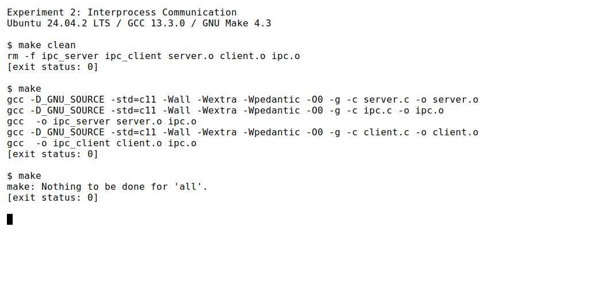
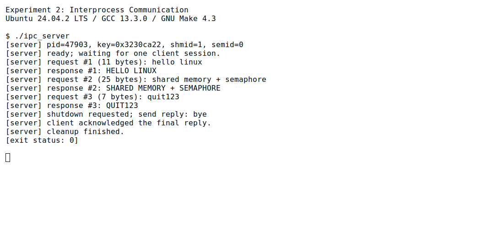
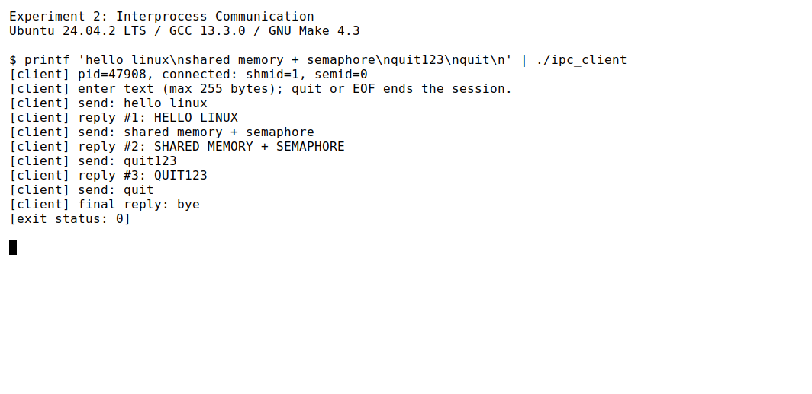
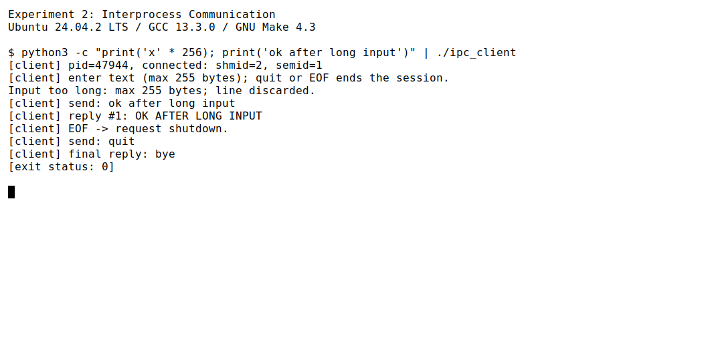
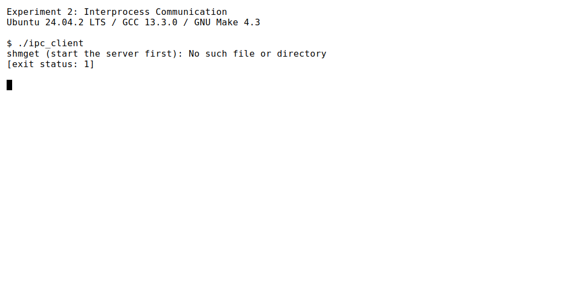

学号：待填写　　姓名：待填写　　专业：待填写　　班级：待填写

# 《Linux操作系统设计实践》实验二：进程通信

实验日期：2026 年 9 月 17 日

## 一、实验环境

| 项目 | 实际使用的环境 |
| --- | --- |
| 操作系统 | Ubuntu 24.04.2 LTS，运行于 WSL2 |
| Linux 内核 | 6.6.87.2-microsoft-standard-WSL2 |
| 体系结构 | x86_64 |
| C 编译器 | GCC 13.3.0 |
| 构建工具 | GNU Make 4.3 |
| 默认编译选项 | `-std=c11 -Wall -Wextra -Wpedantic -O0 -g` |
| 接口声明 | `-D_GNU_SOURCE`，用于声明 Linux 的 `semtimedop` 等接口 |
| 进程间通信方式 | System V 共享内存、System V 信号量集 |
| 辅助验证工具 | Python 3，仅标准库；运行时不依赖 Python |
| 截图方式 | 实际运行的 xterm 白底黑字窗口，`DejaVu Sans Mono` 字体 |

实验文件位于 `homework/task2`。以下编译与运行命令均在该目录执行。服务器和客户端是分别启动的两个独立进程，不要求具有父子关系。

## 二、实验内容

### 2.1 实验目的与要求

根据实验指导书 PDF 第 5 页（印刷页码 3）的要求，自选一种本地进程间通信机制，实现客户端进程与服务器端进程之间的信息发送和接收。本实验结合预备内容中重点学习的共享内存、信号量，编写一个文本转换服务。

客户端发送一行文本，服务器将 ASCII 小写字母转换为大写，再把结果返回客户端。例如，发送 `hello linux` 后收到 `HELLO LINUX`。除 ASCII 小写字母外的字节保持原样，因此 UTF-8 中文可以原样传递。输入完整的 `quit`，或输入流到达 EOF 时，客户端请求结束本次会话。

| 指导书要求 | 本实验的实现 |
| --- | --- |
| 用 C 语言编写程序 | `server.c`、`client.c`、`ipc.c`、`ipc.h` |
| 自选本地 IPC 机制 | 共享内存传递请求和回复，信号量控制访问顺序 |
| 客户端与服务器发送、接收信息 | 客户端发送文本并接收转换结果，服务器接收请求并发送回复 |
| 代码有注释 | 注释说明 P/V 操作、初始化顺序、输入检查和退出握手 |
| 白色背景的运行截图 | 保存 5 张真实 xterm 窗口截图及对应日志 |
| 分析设计、改进、结果与问题 | 见程序设计、运行分析及实验总结 |

### 2.2 程序设计思想

#### （1）共享内存中的数据

两个进程使用 `shmat` 把同一共享内存段附加到各自的地址空间，通过 `struct shared_data` 读写其中的数据。两个进程的虚拟地址可以不同，只要它们引用的是同一个共享内存对象即可。

| 字段 | 作用 |
| --- | --- |
| `magic` | 协议标记，辅助检查是否为本程序的共享内存布局 |
| `sequence` | 已处理普通文本请求的序号，由服务器递增 |
| `request_type` | 区分普通文本与退出请求 |
| `request[256]` | 客户端写入的请求字符串 |
| `response[256]` | 服务器写入的回复字符串 |

每条文本最多 255 字节，另留 1 字节存放 `\0`。长度按字节计算，不等于中文字符数。输入用于普通文本，不支持嵌入 NUL 字节的二进制数据。

#### （2）信号量与收发顺序

仅让两个进程访问同一块内存，不能保证“写完后再读”或“读完后再覆盖”。因此设置三个信号量：

| 信号量 | 初值 | 用途 |
| --- | --- | --- |
| `SEM_SESSION` | 1 | 一次性占用客户端会话，防止第二客户端覆盖数据 |
| `SEM_REQUEST` | 0 | 客户端发布请求，服务器等待请求；退出阶段也用于最后确认 |
| `SEM_RESPONSE` | 0 | 服务器发布回复，客户端等待回复 |

普通收发过程如下：

1. 客户端写入 `request_type` 和 `request`，对 `SEM_REQUEST` 执行 V 操作，再对 `SEM_RESPONSE` 执行 P 操作等待。
2. 服务器对 `SEM_REQUEST` 执行 P 操作，取得请求后读取数据、更新序号、生成回复，最后对 `SEM_RESPONSE` 执行 V 操作。
3. 客户端的等待结束后读取并打印回复，再接收下一行输入。服务器返回等待下一条请求的位置。

因此，同一时刻只有一个未完成的请求。服务器发布回复之前，客户端不会读取回复；客户端读取完回复之前，不会发布下一条请求。这样既避免读到未完成的数据，也避免覆盖尚未处理的请求。

P 操作使用 `semtimedop` 在内核中阻塞等待，每次最长等待 1 秒，超时后检查是否收到退出信号，再继续等待。这 1 秒只用于保证退出标志能够被检查，不决定数据是否就绪；数据就绪仍由信号量控制。V 操作使用 `semop`。程序没有使用 `sleep` 安排收发，也没有循环查询 `GETVAL` 忙等。

`SEM_SESSION` 是一次性会话入口，而不是每条消息都释放的互斥锁。客户端占用后不重新开放，所以本实验明确采用“一次服务器运行、一个客户端会话、多轮请求回复”的范围。多个客户端并发服务不在本次实现范围内。

#### （3）创建、连接与退出

服务器通过 `ftok(".", '2')` 生成键，也允许指定一个双方共用的现有文件或目录。共享内存和信号量属于不同的 System V IPC 对象类型，可以使用相同键值。`ftok` 并不保证全局唯一，因此服务器用 `IPC_CREAT | IPC_EXCL` 独占创建，遇到已有对象时直接报错，避免重置信号量或误用旧数据。

服务器先初始化共享内存，再用 `SETALL` 设置 `{1, 0, 0}`，开放会话入口。客户端只打开已有对象，不使用 `IPC_CREAT`；若服务器没有启动、仍在初始化或会话已被占用，会明确报错。对象权限为 `0600`，供同一用户的两个进程访问。

退出时也需要同步：客户端发布退出请求，服务器回复 `bye`，客户端收到并打印后，再对 `SEM_REQUEST` 执行一次 V 操作作为最终确认。服务器取得确认后才删除信号量，并将共享内存标记为删除。两端分别用 `shmdt` 脱离；最后一个附加进程脱离后，共享内存最终释放。

如果服务器一发送 `bye` 就删除信号量，客户端可能还没有执行接收回复的 P 操作，从而得到 `EIDRM` 或 `EINVAL`。最后的确认步骤避免了这种正常退出过程中的竞态。

### 2.3 源程序

以下为随报告提供的完整 C 源程序和 Makefile，与实际编译文件一致。`verify.py` 是辅助检查脚本，不参与两个 C 程序的编译和运行。

#### （1）ipc.h：公共数据结构与声明

```c
#ifndef TASK2_IPC_H
#define TASK2_IPC_H

#include <signal.h>
#include <sys/ipc.h>

#define TEXT_CAPACITY 256
#define IPC_MAGIC 0x49504332U

/* 每次服务器运行只接受一个客户端会话；一个会话可以多次收发。 */
enum { SEM_SESSION, SEM_REQUEST, SEM_RESPONSE, SEM_COUNT };
enum { REQUEST_TEXT = 1, REQUEST_QUIT };

struct shared_data {
    unsigned int magic;
    unsigned int sequence;
    int request_type;
    char request[TEXT_CAPACITY];
    char response[TEXT_CAPACITY];
};

/* glibc 要求应用程序自行定义 semctl 第四个参数所用的联合体。 */
union semun {
    int val;
    struct semid_ds *buf;
    unsigned short *array;
};

extern volatile sig_atomic_t ipc_interrupted;

int ipc_setup(void);
int ipc_make_key(const char *path, key_t *key);
int ipc_wait(int semid, unsigned short index);
int ipc_post(int semid, unsigned short index);

#endif
```

#### （2）ipc.c：初始化与 P/V 操作

```c
#include "ipc.h"

#include <errno.h>
#include <stdio.h>
#include <sys/sem.h>
#include <time.h>

volatile sig_atomic_t ipc_interrupted = 0;

static void handle_signal(int signo)
{
    /* 不在异步信号处理函数中输出或删除 IPC 对象。 */
    ipc_interrupted = signo;
}

int ipc_setup(void)
{
    struct sigaction action = {0};

    if (setvbuf(stdout, NULL, _IOLBF, 0) != 0) {
        fprintf(stderr, "Cannot enable stdout line buffering.\n");
        return -1;
    }
    action.sa_handler = handle_signal;
    sigemptyset(&action.sa_mask);
    if (sigaction(SIGINT, &action, NULL) == -1 ||
        sigaction(SIGTERM, &action, NULL) == -1) {
        perror("sigaction");
        return -1;
    }
    return 0;
}

int ipc_make_key(const char *path, key_t *key)
{
    /* 两端使用同一现有路径；共享内存和信号量分属不同的 IPC 名字空间。 */
    *key = ftok(path, '2');
    if (*key == (key_t)-1) {
        perror("ftok");
        return -1;
    }
    return 0;
}

int ipc_wait(int semid, unsigned short index)
{
    struct sembuf operation = {index, -1, 0};

    for (;;) {
        struct timespec timeout = {1, 0};
        if (ipc_interrupted) {
            errno = EINTR;
            return -1;
        }
        /* P 操作：由内核阻塞等待。超时仅用于定期检查退出信号，
         * 不用于决定数据是否就绪，也不靠 sleep 或 GETVAL 忙等。 */
        if (semtimedop(semid, &operation, 1, &timeout) == 0) {
            return 0;
        }
        if (errno != EINTR && errno != EAGAIN) {
            return -1;
        }
    }
}

int ipc_post(int semid, unsigned short index)
{
    struct sembuf operation = {index, 1, 0};
    int result;

    /* V 操作：发布刚写好的请求、回复或最后的退出确认。 */
    do {
        result = semop(semid, &operation, 1);
    } while (result == -1 && errno == EINTR && !ipc_interrupted);
    return result;
}
```

#### （3）server.c：服务器

```c
#include "ipc.h"

#include <errno.h>
#include <stdio.h>
#include <string.h>
#include <sys/sem.h>
#include <sys/shm.h>
#include <unistd.h>

int main(int argc, char *argv[])
{
    const char *key_path = argc == 2 ? argv[1] : ".";
    key_t key;
    int shmid = -1, semid = -1, result = 1;
    struct shared_data *data = (void *)-1;
    unsigned short initial_values[SEM_COUNT] = {1, 0, 0};
    union semun options = {.array = initial_values};

    if (argc > 2) {
        fprintf(stderr, "Usage: %s [existing-key-path]\n", argv[0]);
        return 2;
    }
    if (ipc_setup() == -1 || ipc_make_key(key_path, &key) == -1) {
        return 1;
    }
    /* 独占创建，拒绝覆盖另一服务器或异常退出后遗留的资源。 */
    shmid = shmget(key, sizeof(*data), IPC_CREAT | IPC_EXCL | 0600);
    if (shmid == -1) {
        perror("shmget (exclusive create)");
        return 1;
    }
    data = shmat(shmid, NULL, 0);
    if (data == (void *)-1) {
        perror("shmat");
        goto cleanup;
    }
    semid = semget(key, SEM_COUNT, IPC_CREAT | IPC_EXCL | 0600);
    if (semid == -1) {
        perror("semget (exclusive create)");
        goto cleanup;
    }
    memset(data, 0, sizeof(*data));
    data->magic = IPC_MAGIC;
    /* 初始化内存后才开放会话入口，客户端不会读到尚未初始化的数据。 */
    if (semctl(semid, 0, SETALL, options) == -1) {
        perror("semctl (SETALL)");
        goto cleanup;
    }
    printf("[server] pid=%ld, key=0x%08lx, shmid=%d, semid=%d\n",
           (long)getpid(), (unsigned long)(unsigned int)key, shmid, semid);
    printf("[server] ready; waiting for one client session.\n");

    for (;;) {
        if (ipc_wait(semid, SEM_REQUEST) == -1) {
            perror("wait for request");
            goto cleanup;
        }
        if (data->request_type == REQUEST_QUIT) {
            strcpy(data->response, "bye");
            printf("[server] shutdown requested; send reply: bye\n");
            if (ipc_post(semid, SEM_RESPONSE) == -1 ||
                ipc_wait(semid, SEM_REQUEST) == -1) {
                perror("shutdown handshake");
                goto cleanup;
            }
            /* 收到最终确认后再删除信号量，避免客户端尚未取得回复。 */
            printf("[server] client acknowledged the final reply.\n");
            result = 0;
            break;
        }
        size_t length = strnlen(data->request, TEXT_CAPACITY);
        if (data->request_type != REQUEST_TEXT || length == TEXT_CAPACITY) {
            fprintf(stderr, "Invalid request in shared memory.\n");
            goto cleanup;
        }
        ++data->sequence;
        for (size_t i = 0; i < length; ++i) {
            unsigned char c = (unsigned char)data->request[i];
            /* 只转换 ASCII 小写字母，保留 UTF-8 等其他字节。 */
            data->response[i] = (char)(c >= 'a' && c <= 'z' ? c - 'a' + 'A' : c);
        }
        data->response[length] = '\0';
        printf("[server] request #%u (%zu bytes): %s\n",
               data->sequence, length, data->request);
        printf("[server] response #%u: %s\n", data->sequence, data->response);
        if (ipc_post(semid, SEM_RESPONSE) == -1) {
            perror("post response");
            goto cleanup;
        }
    }

cleanup:
    if (ipc_interrupted) {
        printf("[server] interrupted by signal=%d\n", (int)ipc_interrupted);
        result = 128 + ipc_interrupted;
    }
    /* 只清理由本次运行创建成功的对象；所有退出路径汇聚于此。 */
    if (semid != -1 && semctl(semid, 0, IPC_RMID) == -1) {
        perror("semctl (IPC_RMID)");
        result = 1;
    }
    if (shmid != -1 && shmctl(shmid, IPC_RMID, NULL) == -1) {
        perror("shmctl (IPC_RMID)");
        result = 1;
    }
    if (data != (void *)-1 && shmdt(data) == -1) {
        perror("shmdt");
        result = 1;
    }
    printf("[server] cleanup finished.\n");
    return result;
}
```

#### （4）client.c：客户端

```c
#include "ipc.h"

#include <errno.h>
#include <stdio.h>
#include <string.h>
#include <sys/sem.h>
#include <sys/shm.h>
#include <unistd.h>

/* 返回 1 表示一行，0 表示 EOF，2 表示过长，-1 表示读取失败。 */
static int read_line(char text[TEXT_CAPACITY])
{
    if (fgets(text, TEXT_CAPACITY, stdin) == NULL) {
        return ferror(stdin) ? -1 : 0;
    }
    size_t length = strlen(text);
    if (length > 0 && text[length - 1] == '\n') {
        text[--length] = '\0';
    } else {
        /* 多读一个字符：区分恰好 255 字节与超过容量的输入。 */
        int c = getchar();
        if (c != '\n' && c != EOF) {
            do {
                c = getchar();
            } while (c != '\n' && c != EOF);
            return ferror(stdin) ? -1 : 2;
        }
        if (ferror(stdin)) {
            return -1;
        }
    }
    return 1;
}

int main(int argc, char *argv[])
{
    const char *key_path = argc == 2 ? argv[1] : ".";
    key_t key;
    int result = 1;
    struct shared_data *data = (void *)-1;
    struct shmid_ds info;
    struct sembuf claim = {SEM_SESSION, -1, IPC_NOWAIT};

    if (argc > 2) {
        fprintf(stderr, "Usage: %s [existing-key-path]\n", argv[0]);
        return 2;
    }
    if (ipc_setup() == -1 || ipc_make_key(key_path, &key) == -1) {
        return 1;
    }
    /* 客户端只打开现有对象，不能先于服务器创建未初始化的资源。 */
    int shmid = shmget(key, sizeof(*data), 0600);
    if (shmid == -1) {
        perror("shmget (start the server first)");
        return 1;
    }
    int semid = semget(key, SEM_COUNT, 0600);
    if (semid == -1) {
        perror("semget (start the server first)");
        return 1;
    }
    if (shmctl(shmid, IPC_STAT, &info) == -1) {
        perror("shmctl (IPC_STAT)");
        return 1;
    }
    if (info.shm_segsz != sizeof(*data)) {
        fprintf(stderr, "Shared memory size does not match this program.\n");
        return 1;
    }
    data = shmat(shmid, NULL, 0);
    if (data == (void *)-1) {
        perror("shmat");
        return 1;
    }
    /* 一次性占用会话，拒绝第二客户端，防止请求和回复互相覆盖。
     * 不用 SEM_UNDO 自动重开会话：异常中断后应重启服务器。 */
    if (semop(semid, &claim, 1) == -1) {
        if (errno == EAGAIN) {
            fprintf(stderr, "Server is starting or its client session is already claimed.\n");
        } else {
            perror("claim client session");
        }
        goto cleanup;
    }
    if (data->magic != IPC_MAGIC) {
        fprintf(stderr, "Shared memory protocol does not match this program.\n");
        goto cleanup;
    }
    printf("[client] pid=%ld, connected: shmid=%d, semid=%d\n",
           (long)getpid(), shmid, semid);
    printf("[client] enter text (max 255 bytes); quit or EOF ends the session.\n");

    for (;;) {
        char text[TEXT_CAPACITY];
        if (ipc_interrupted) {
            goto cleanup;
        }
        if (isatty(STDIN_FILENO)) {
            printf("input> ");
            fflush(stdout);
        }
        int read_status = read_line(text);
        if (read_status == -1) {
            perror("read stdin");
            goto cleanup;
        }
        if (read_status == 2) {
            fprintf(stderr, "Input too long: max 255 bytes; line discarded.\n");
            continue;
        }
        int quitting = read_status == 0 || strcmp(text, "quit") == 0;
        if (read_status == 0) {
            printf("[client] EOF -> request shutdown.\n");
        }
        data->request_type = quitting ? REQUEST_QUIT : REQUEST_TEXT;
        strcpy(data->request, quitting ? "quit" : text);
        printf("[client] send: %s\n", data->request);
        if (ipc_post(semid, SEM_REQUEST) == -1 ||
            ipc_wait(semid, SEM_RESPONSE) == -1) {
            perror("request/reply");
            goto cleanup;
        }
        if (strnlen(data->response, TEXT_CAPACITY) == TEXT_CAPACITY) {
            fprintf(stderr, "Invalid response in shared memory.\n");
            goto cleanup;
        }
        if (quitting) {
            printf("[client] final reply: %s\n", data->response);
        } else {
            printf("[client] reply #%u: %s\n", data->sequence, data->response);
        }
        if (quitting) {
            /* 回复已复制到输出后才确认；此后不再访问共享内存数据。 */
            if (ipc_post(semid, SEM_REQUEST) == -1) {
                perror("acknowledge shutdown");
                goto cleanup;
            }
            result = 0;
            break;
        }
    }

cleanup:
    if (ipc_interrupted) {
        printf("[client] interrupted by signal=%d; stop the server to clean up.\n",
               (int)ipc_interrupted);
        result = 128 + ipc_interrupted;
    }
    if (shmdt(data) == -1) {
        perror("shmdt");
        result = 1;
    }
    return result;
}
```

#### （5）Makefile：构建与验证

```makefile
CC = gcc
CPPFLAGS += -D_GNU_SOURCE
CFLAGS ?= -std=c11 -Wall -Wextra -Wpedantic -O0 -g
TARGETS = ipc_server ipc_client
OBJECTS = server.o client.o ipc.o

.PHONY: all verify clean

all: $(TARGETS)

ipc_server: server.o ipc.o
	$(CC) $(LDFLAGS) -o $@ $^ $(LDLIBS)

ipc_client: client.o ipc.o
	$(CC) $(LDFLAGS) -o $@ $^ $(LDLIBS)

%.o: %.c ipc.h
	$(CC) $(CPPFLAGS) $(CFLAGS) -c $< -o $@

verify: all
	python3 verify.py

clean:
	rm -f $(TARGETS) $(OBJECTS)
```

Makefile 的配方使用 Tab 缩进。`server.o` 与 `ipc.o` 链接为服务器，`client.o` 与 `ipc.o` 链接为客户端。三个目标文件均声明对 `ipc.h` 的依赖，公共结构变化时会重新编译。`make clean` 只删除可执行文件和目标文件。

### 2.4 编译与构建结果

```sh
make clean
make
make
```



首次 `make` 编译三个源文件，并链接得到 `ipc_server` 和 `ipc_client`，没有警告或错误；再次执行提示 `Nothing to be done for 'all'.`，说明没有文件变化时不会重复构建。

本报告的图片均来自本次实际运行的 xterm 白底终端窗口。图中的 `[exit status: ...]` 由采集程序读取命令真实退出码后打印，相当于紧接着执行 `echo $?`。完整输出保存在 [logs/](logs/) 中。截图中的 PID、IPC 标识符和键值只代表本次运行，重新执行时通常会变化。

### 2.5 运行结果与分析

#### （1）多轮请求与回复

先在终端 A 启动服务器：

```sh
./ipc_server
```

看到 `ready; waiting` 后，在同一目录的终端 B 执行：

```sh
printf 'hello linux\nshared memory + semaphore\nquit123\nquit\n' | ./ipc_client
```

这里的 Shell 管道只用于向客户端提供标准输入。客户端与服务器之间的请求和回复仍通过共享内存及信号量完成。也可以直接执行 `./ipc_client`，逐行键盘输入。





本次服务器 PID 为 `47903`，客户端 PID 为 `47908`，说明两端是不同的进程。两端均打印 `shmid=1, semid=0`，说明连接到相同的共享内存段和信号量集。IPC 标识符 `0` 也是有效值，程序使用 `-1` 判断创建或打开失败。

| 请求序号 | 客户端发送 | 服务器接收长度 | 客户端收到 |
| --- | --- | --- | --- |
| 1 | `hello linux` | 11 字节 | `HELLO LINUX` |
| 2 | `shared memory + semaphore` | 25 字节 | `SHARED MEMORY + SEMAPHORE` |
| 3 | `quit123` | 7 字节 | `QUIT123` |

服务器和客户端的请求序号、文本及转换结果逐一对应，符合顺序收发的预期。`quit123` 被当作普通文本处理；只有完整的 `quit` 才触发退出，避免用前缀匹配误判命令。

客户端最后打印 `final reply: bye`；服务器打印 `client acknowledged the final reply.`，随后执行清理。两端实际退出码均为 `0`。截图分别展示各进程内部的输出顺序，不能据此推断两个窗口之间每行输出的精确时间关系。

#### （2）超长输入与 EOF

重新启动一次服务器后，在另一个终端执行：

```sh
python3 -c "print('x' * 256); print('ok after long input')" | ./ipc_client
```



第一行包含 256 个 ASCII 字符，超过 255 字节限制。客户端提示 `Input too long`，丢弃整行，随后只发送 `ok after long input`，收到 `OK AFTER LONG INPUT`。这条有效消息的序号仍为 `1`，与 [服务器日志](logs/04-boundary-server.txt) 中只有一条普通请求相符。

输入流结束后，客户端打印 `EOF -> request shutdown.`，发送退出请求，收到 `bye` 并返回 `0`。因此用户不必一定输入退出命令，EOF 也能走完整的关闭流程。

边界检查还验证了“恰好 255 字节”的情况：整行可以发送且收到完整的 255 字节回复；超过容量的行不会被拆成多条消息。具体断言见 `verify.py`，结果见 `logs/verification.txt`。

#### （3）客户端先于服务器启动

在上一会话结束、没有服务器运行时执行：

```sh
./ipc_client
```



客户端输出 `shmget (start the server first): No such file or directory`，实际退出码为 `1`。它不会自行创建未初始化的共享内存，也不会停留在无法完成的等待中。这是故意采用错误启动顺序得到的预期失败结果。

#### （4）其他验证

使用独立临时路径隔离每组 IPC 对象，并在有时间上限的子进程中运行真实 C 程序。以 `-O2 -Werror` 重新编译后执行了 9 组集成检查，完整命令及输出见 [verification.txt](logs/verification.txt)。其中 `-Werror` 把编译警告视为错误。

| 检查项目 | 方法 | 实际结果 |
| --- | --- | --- |
| 启动顺序 | 在独立键路径下直接运行客户端 | 返回 `1`，未创建 IPC 对象 |
| 连续通信与文本内容 | 连续发送 100 条编号消息，再发送 `quit123`、空行和 `linux 中文` | 103 条回复逐条匹配序号与内容，中文原样保留，正常退出 |
| 长度边界 | 依次发送 255 字节、256 字节、正常文本 | 接受 255 字节，拒绝整条 256 字节输入，后续消息正常 |
| 无末尾换行的 EOF | 发送最后一行后直接关闭输入流 | 最后一行先收到回复，随后自动退出 |
| 重复服务器 | 在已有服务器的同一个键上再次启动 | 第二个返回 `1`，原服务器仍可正常处理消息 |
| 第二客户端 | 第一个客户端已连接时再启动一个客户端 | 第二个返回 `1`，原客户端仍可收发 |
| 服务器等待时中断 | 对等待请求的服务器发送 `SIGINT` | 返回 `130`，共享内存和信号量的键均不再可打开 |
| 客户端等待时服务器终止 | 暂停服务器，让客户端发送请求；再发送 `SIGTERM` 并恢复服务器 | 服务器返回 `143`，客户端因 IPC 被删除返回 `1`，没有挂起 |
| 部分初始化失败 | 预先创建同键信号量，令服务器在创建共享内存后创建信号量失败 | 只删除本次创建的共享内存，原有信号量仍存在 |

测试结束后检查各组键对应的共享内存和信号量均无法再打开；测试中预先创建的信号量也由测试脚本自行删除。服务器按 `128 + 信号编号` 返回因中断而结束的状态，所以 `SIGINT` 对应 `130`，`SIGTERM` 对应 `143`。

## 三、实验总结

### 3.1 与示例程序相比的改进

本实验参考了 `example/task2/2-3shm-write.c`、`2-3shm-read.c` 中共享内存的创建与附加方式，以及 `2-4semshm-.h`、`2-4semshm-write.c`、`2-4semshm-read.c` 中通过信号量组织共享内存访问的思路。

1. **从单向读写扩展为请求与回复。** 客户端发送文本，服务器处理并回复；两个缓冲区分别保存请求和结果，便于观察完整的客户端—服务器交互过程。
2. **明确数据就绪条件。** 示例中的单个互斥信号量只限制同时访问，不能单独保证每条数据恰好处理一次。本实验用请求就绪、回复就绪两个信号量明确推进方向，避免重复读取旧内容或覆盖未处理内容。
3. **直接阻塞等待。** 示例的 `wait_sem` 查询 `GETVAL` 后再进行 `IPC_NOWAIT` 的 P 操作，检查与操作之间存在窗口。本实验通过内核的 P 操作等待，不采用先查询数值再决定是否获取的方式。
4. **统一初始化责任。** 只有服务器创建和初始化对象，客户端只连接。服务器独占创建，重复启动不会把已有信号量重设为初值。
5. **补全字符串边界。** `2-3shm-write.c` 中的 `s='\0'` 修改的是指针，不能代替 `*s='\0'` 写入字符串结束符。本程序明确为回复写入 `\0`，并检查容量、输入长度和 EOF。
6. **增加退出确认与错误处理。** 正常结束先确认最后回复，再清理资源；系统调用失败时输出原因并返回非零值。服务器初始化失败或收到可处理的退出信号时，只清理自己创建的对象。

### 3.2 学习与应用的相关知识

**共享内存与同步职责。** `shmget` 创建或获取共享内存对象，`shmat` 建立进程地址空间到共享内存的映射。进程可以直接通过指针读写数据，但共享内存本身不会规定谁先写、谁后读。信号量负责组织访问顺序，数据内容仍存放在共享内存中。

**互斥与消息就绪的区别。** 防止两个进程同时访问，并不自动意味着读到的是一条新消息。本实验把“收到新请求”和“已经生成回复”分别表示为信号量上的事件，使每个阶段都有明确的进入条件。

**P/V 操作与退出信号。** `sem_op=-1` 表示申请一个计数，为零时需要等待；`sem_op=+1` 表示增加计数，可以使等待者继续执行。`semtimedop` 被信号中断或超时后，需要重新判断退出条件。本程序的信号处理函数只修改 `volatile sig_atomic_t` 标志，把输出和清理放回普通执行流程。

**内核对象的生命周期。** 普通进程退出不会自动删除 System V IPC 对象。`shmdt` 只解除当前进程的附加，`shmctl(IPC_RMID)` 才将共享内存标记为删除；信号量用 `semctl(IPC_RMID)` 删除。程序必须分别处理进程退出和 IPC 对象回收。

**SEM_UNDO 的适用范围。** `SEM_UNDO` 可以在进程退出时撤销部分信号量调整，但不能撤销共享内存中写到一半的数据，也不能恢复整个应用协议。本实验的会话入口不自动释放；客户端异常中断后，应结束并重启服务器，避免让新客户端接收到上一会话遗留的回复。

**输入边界与字节长度。** 缓冲区还要为 `\0` 留出空间。当一次读取填满 255 字节时，必须再判断下一个字符是换行、EOF 还是更多正文，才能区分合法边界与超长输入。超长行需要完整消费，否则剩余字符会被当成下一条请求。

### 3.3 问题分析与解决方法

以下列出实现时重点处理的问题，以及对应的验证依据。

| 问题 | 分析与处理 | 验证情况 |
| --- | --- | --- |
| 共享内存可能被过早读取或覆盖 | 按“写请求→发布请求→生成回复→发布回复→读取回复”的顺序交接 | 103 次连续收发逐条核对，序号、内容均匹配 |
| 最后一条回复可能因删除信号量过早而失败 | 为退出请求增加客户端最终确认 | 两端截图均正常退出；服务器明确记录收到确认 |
| 255 字节输入容易与超长输入混淆 | 读取额外一个字符判断行尾，超长时丢弃整行 | 接受 255 字节，拒绝 256 字节，下一条消息不受影响 |
| 同键重复启动可能破坏现有通信 | 服务器独占创建；只清理创建成功的对象 | 重复服务器被拒绝，部分初始化失败保留原有信号量 |
| 第二客户端可能覆盖共享缓冲区 | 用一次性会话信号量限制客户端数量 | 第二个客户端被拒绝，首个客户端继续完成通信 |
| 服务器终止时客户端可能一直等待 | 删除信号量会使阻塞操作返回错误，客户端检查并退出 | 服务器收到 `SIGTERM` 后，等待客户端返回 `1`，未挂起 |

各项实测结果与设计预期一致。当前实现用于单客户端会话；如果客户端异常结束，需结束服务器再重新启动。`SIGKILL` 无法被捕获，服务器被强制杀死时不能执行清理，需要用 `ipcs` 核对本次实验对象，再按具体标识符用 `ipcrm` 删除。`README.md` 给出了相应操作方法。

本实验通过真实的双进程收发与资源检查，验证了共享内存负责传递数据、信号量负责协调时序的分工，也明确了输入边界、错误传播和退出握手对完整 IPC 程序的作用。

### 3.4 参考材料

1. 《Linux操作系统设计实践》2026—2027 第一学期实验指导书，PDF 第 5 页（印刷页码 3）。
2. 本课程示例：`example/task2/2-3shm-write.c`、`2-3shm-read.c`、`2-4semshm-.h`、`2-4semshm-write.c`、`2-4semshm-read.c`。
3. 本仓库 `homework/task1/README.md`、`report.md` 及白底 xterm 截图，用于统一实验材料格式。
