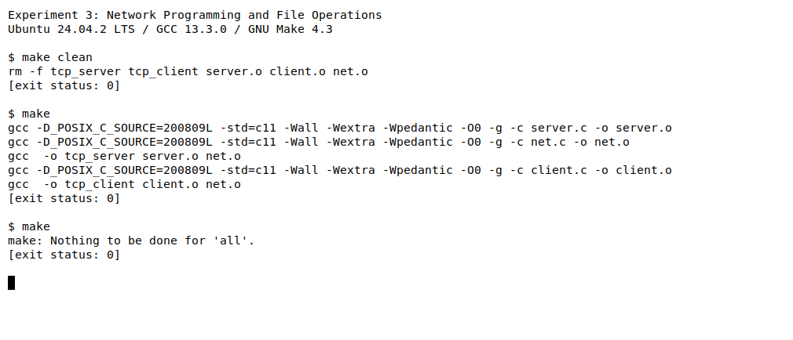
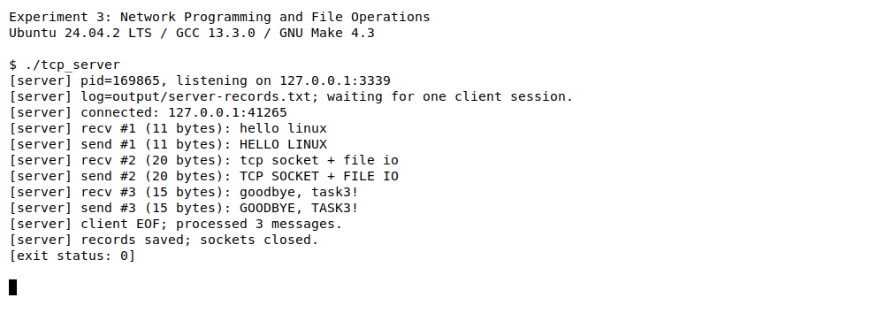
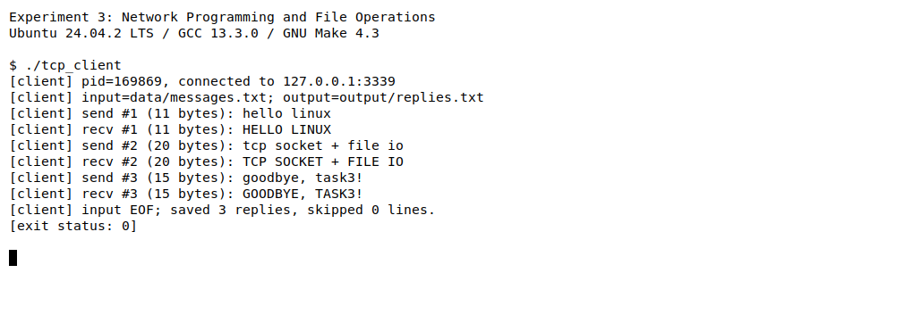
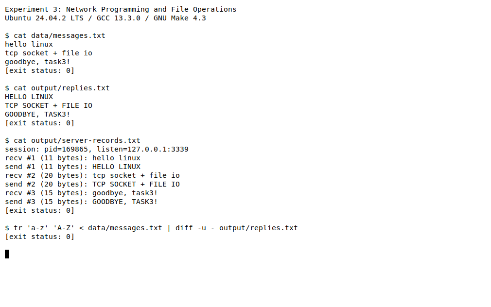
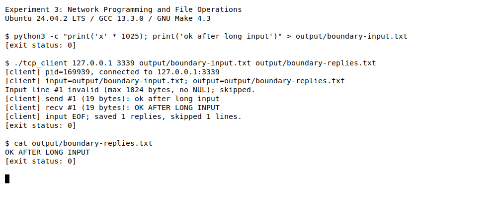
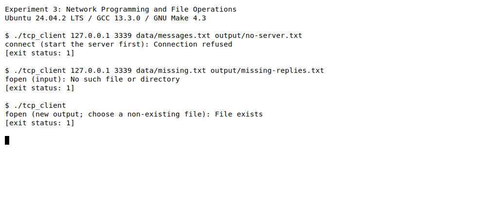

学号：待填写　　姓名：待填写　　专业：待填写　　班级：待填写

# 《Linux操作系统设计实践》实验三：网络编程及文件操作

实验日期：2026 年 9 月 24 日

## 一、实验环境

| 项目 | 实际使用的环境 |
| --- | --- |
| 操作系统 | Ubuntu 24.04.2 LTS，运行于 WSL2 |
| Linux 内核 | 6.6.87.2-microsoft-standard-WSL2 |
| 体系结构 | x86_64 |
| C 编译器 | GCC 13.3.0 |
| 构建工具 | GNU Make 4.3 |
| 默认编译选项 | `-std=c11 -Wall -Wextra -Wpedantic -O0 -g` |
| 接口声明 | `-D_POSIX_C_SOURCE=200809L` |
| 网络通信方式 | IPv4、TCP、`SOCK_STREAM`，本机回环通信 |
| 文件操作方式 | C 标准 I/O 数据流，`fopen`、`fgetc`、`fwrite`、`fprintf`、`fflush`、`fclose` |
| 辅助验证工具 | Python 3，仅标准库；运行 C 程序时不依赖 Python |
| 截图方式 | 实际运行的 xterm 白底黑字窗口，`DejaVu Sans Mono` 字体 |

实验文件位于 `homework/task3`。以下编译和运行命令均在该目录执行。服务器、客户端在两个终端中分别启动；本次实测使用 `127.0.0.1` 和 `localhost`，未进行跨计算机通信实测。

## 二、实验内容

### 2.1 实验目的与要求

实验三要求使用套接口实现客户端与服务器之间的信息发送、接收，并通过文件 I/O 读取和保存收发信息。预备内容重点要求学习网络编程模式及基于数据流的文件 I/O。

本实验实现“从文件读取文本、通过 TCP 转换文本、把回复保存到文件”的客户端—服务器程序。客户端逐行发送文本，服务器把 ASCII 小写字母转换为大写，再将结果发送给客户端。服务器同时把收到的请求和发出的回复追加保存到日志文件，便于离线核对完整通信过程。

| 指导书要求 | 本实验的实现 |
| --- | --- |
| 使用 C 语言编写程序 | `server.c`、`client.c`、`net.c`、`net.h` |
| 使用套接口通信机制 | IPv4 TCP，服务器 `socket/bind/listen/accept`，客户端 `socket/connect` |
| 客户端、服务器均发送和接收信息 | 客户端发送原文、接收转换结果；服务器接收原文、发送转换结果 |
| 利用文件 I/O 读取信息 | 客户端用 `fopen("r")`、`fgetc` 逐行读取输入文件 |
| 利用文件 I/O 保存信息 | 客户端用 `fwrite/fputc` 保存回复；服务器用 `fprintf` 追加记录双方收发内容 |
| 代码有注释、运行结果有白底截图 | 提供完整注释源码、6 张实际 xterm 截图及对应日志 |
| 分析程序思想、改进、学习和问题解决 | 见 2.2 节及第三部分 |

### 2.2 程序设计思想

#### （1）文件与进程的分工

默认输入文件 `data/messages.txt` 包含三行文本。一次服务器运行服务一个客户端连接，同一连接中可以连续处理多行文本。文件读完即结束会话，不需要额外输入退出命令；字符串 `quit` 也作为普通文本转换。

| 文件 | 打开模式与操作 | 作用 |
| --- | --- | --- |
| `data/messages.txt` | `fopen(..., "r")`、`fgetc` | 客户端读取待发送的文本 |
| `output/replies.txt` | `fopen(..., "wx")`、`fwrite`、`fputc` | 客户端创建新文件，逐行保存收到的回复 |
| `output/server-records.txt` | `fopen(..., "a")`、`fprintf` | 服务器追加保存会话信息、接收原文和发送结果 |

`"wx"` 中的 `x` 表示独占创建：如果目标已经存在，打开失败。这可以防止覆盖上次结果，也可以防止把输入文件或它的符号链接误当作输出而截断原文。重复实验时应选择新的输出文件名。服务器日志使用追加模式，保留之前会话的信息。

文本以 LF 为行分隔符，一行最多 1024 字节，换行和字符串结束符不计入长度。空行允许发送，文件末尾没有换行的最后一行也会发送。超过长度或包含 NUL 的整行会被消费并跳过，客户端给出提示后继续读取下一行。回复文件为每条有效回复补一个 LF；因此没有末尾换行的输入会在结果中补齐换行。长度按字节计算，UTF-8 中文不等于一个字节；转换只修改 ASCII 的 `a` 至 `z`，其余字节保持原样。

#### （2）套接口建立与收发流程

1. 服务器创建 `AF_INET/SOCK_STREAM` 套接口，设置 `SO_REUSEADDR`，绑定 IPv4 地址和端口，然后调用 `listen` 等待连接。默认地址为 `127.0.0.1:3339`。
2. 客户端打开输入和新的输出文件，用 `getaddrinfo` 解析主机名或 IPv4 地址，创建套接口并调用 `connect`。
3. 服务器通过 `accept` 获得已连接套接口，关闭本次不再使用的监听套接口。随后从已连接套接口接收请求、转换并回复，逐条保存收发记录。
4. 客户端每读取一行就发送一个请求，等待一个完整回复并写入结果文件，再读取下一行，因此正常客户端始终最多只有一个未完成请求。
5. 输入结束后，客户端调用 `shutdown(fd, SHUT_WR)`，只关闭发送方向。服务器在下一条消息的边界读到 EOF，退出接收循环并关闭连接；客户端等待服务器 EOF 后关闭文件和套接口。

监听套接口负责接入，`accept` 返回的套接口负责具体收发。`listen(..., 5)` 的队列参数不表示同时服务 5 个客户端。本程序明确采用单连接、多轮收发的范围，没有实现并发服务器。

服务器允许指定端口 `0` 让系统分配空闲端口，再用 `getsockname` 取得实际端口；这一方式用于隔离自动验证。客户端必须指定实际的非零端口。若要在两台计算机上运行，服务器可绑定 `0.0.0.0`，客户端填写服务器实际的 IPv4 地址；默认的回环地址仅用于本机。

#### （3）TCP 消息边界与错误处理

TCP 提供有序字节流，一次 `send` 不对应一次 `recv`。一个消息可能分多次读到，多条消息也可能出现在同一段接收数据中。因此定义统一的消息帧：

| 部分 | 大小 | 解释 |
| --- | --- | --- |
| 长度报头 | 4 字节 | `uint32_t`，经 `htonl` 转换为网络字节序 |
| 文本正文 | 0～1024 字节 | 不含换行分隔符，不发送 C 字符串的 `\0` |

发送方把报头和正文放入同一缓冲区，再通过 `send_all` 循环发送直到完成。接收方先累计读取完整的 4 字节报头，通过 `ntohl` 取得长度，检查范围，再累计读取正文，最后补上 `\0`。零长度帧是一条合法空文本；尚未收到下一帧任何字节时的连接 EOF 才表示会话结束。

`receive_exact` 区分正常 EOF 和帧中途断开；已收到报头却缺少正文也按协议错误处理。遇到 `EINTR` 重试，其他错误返回调用者。发送使用 Linux 的 `MSG_NOSIGNAL`，连接断开时报告错误，避免由 `SIGPIPE` 直接终止程序。客户端尚未收到当前请求的回复时，即使在帧边界出现 EOF，也视为异常。

文件写入后立即检查 `fflush`，关闭时检查 `fclose`，可以发现缓冲区真正写出时的错误。`fflush` 不等于断电后仍能保存的磁盘持久性保证；服务器的发送记录也只说明 `send` 已成功提交数据，不等于对端文件已经写入。本实验通过客户端结果文件的独立比对验证实际接收和保存。

### 2.3 源程序

以下为随报告提供的完整 C 源程序、Makefile 和默认输入，与实际文件一致。`verify.py` 是辅助集成检查脚本，不参与 C 程序的编译和运行。

#### （1）net.h：公共常量与接口

```c
#ifndef TASK3_NET_H
#define TASK3_NET_H

#include <stddef.h>
#include <stdint.h>
#include <stdio.h>

#define MAX_TEXT 1024
#define DEFAULT_PORT "3339"

int setup_output(void);
int parse_port(const char *text, int allow_zero, uint16_t *port);
int connect_server(const char *host, const char *service);
int send_frame(int fd, const char *text, size_t length);
/* 返回 1 表示完整消息，0 表示消息边界上的 EOF，-1 表示错误。 */
int receive_frame(int fd, char text[MAX_TEXT + 1], size_t *length);
/* 返回 1 表示一行，0 表示 EOF，-1 表示读错误，-2 表示非法行。 */
int read_text_line(FILE *input, char text[MAX_TEXT + 1], size_t *length);

#endif
```

#### （2）net.c：协议收发、输入读取与连接

```c
#include "net.h"

#include <arpa/inet.h>
#include <errno.h>
#include <netdb.h>
#include <stdlib.h>
#include <string.h>
#include <sys/socket.h>
#include <unistd.h>

int setup_output(void)
{
    if (setvbuf(stdout, NULL, _IOLBF, 0) != 0) {
        fprintf(stderr, "Cannot enable stdout line buffering.\n");
        return -1;
    }
    return 0;
}

int parse_port(const char *text, int allow_zero, uint16_t *port)
{
    char *end;
    long value;

    /* 不接受负数、空串、尾随字符或溢出的端口号。 */
    if (*text < '0' || *text > '9') {
        return -1;
    }
    errno = 0;
    value = strtol(text, &end, 10);
    if (errno || *end || value < (allow_zero ? 0 : 1) || value > 65535) {
        return -1;
    }
    *port = (uint16_t)value;
    return 0;
}

int connect_server(const char *host, const char *service)
{
    struct addrinfo hints = {0}, *addresses;
    int fd = -1, saved_errno = ECONNREFUSED;

    hints.ai_family = AF_INET;
    hints.ai_socktype = SOCK_STREAM;
    hints.ai_flags = AI_NUMERICSERV;
    int error = getaddrinfo(host, service, &hints, &addresses);
    if (error != 0) {
        fprintf(stderr, "getaddrinfo: %s\n", gai_strerror(error));
        return -1;
    }
    /* 主机名可能对应多个 IPv4 地址，逐个尝试连接。 */
    for (struct addrinfo *p = addresses; p != NULL; p = p->ai_next) {
        fd = socket(p->ai_family, p->ai_socktype, p->ai_protocol);
        if (fd != -1) {
            if (connect(fd, p->ai_addr, p->ai_addrlen) == 0) {
                break;
            }
            saved_errno = errno;
            close(fd);
            fd = -1;
        } else {
            saved_errno = errno;
        }
    }
    freeaddrinfo(addresses);
    if (fd == -1) {
        errno = saved_errno;
        perror("connect (start the server first)");
    }
    return fd;
}

static int send_all(int fd, const void *buffer, size_t length)
{
    const unsigned char *p = buffer;
    size_t sent = 0;

    while (sent < length) {
        /* MSG_NOSIGNAL 使断开的连接返回错误，避免 SIGPIPE 直接终止进程。 */
        ssize_t n = send(fd, p + sent, length - sent, MSG_NOSIGNAL);
        if (n < 0 && errno == EINTR) {
            continue;
        }
        if (n <= 0) {
            if (n == 0) {
                errno = EPIPE;
            }
            return -1;
        }
        sent += (size_t)n;
    }
    return 0;
}

static int receive_exact(int fd, void *buffer, size_t length)
{
    unsigned char *p = buffer;
    size_t received = 0;

    while (received < length) {
        ssize_t n = recv(fd, p + received, length - received, 0);
        if (n < 0 && errno == EINTR) {
            continue;
        }
        if (n < 0) {
            return -1;
        }
        if (n == 0) {
            if (received == 0) {
                return 0;
            }
            errno = EPROTO; /* 收到一部分后断开，不是一条完整消息。 */
            return -1;
        }
        received += (size_t)n;
    }
    return 1;
}

int send_frame(int fd, const char *text, size_t length)
{
    unsigned char frame[sizeof(uint32_t) + MAX_TEXT];

    if (length > MAX_TEXT) {
        errno = EMSGSIZE;
        return -1;
    }
    uint32_t header = htonl((uint32_t)length);
    /* 将报头和正文合并提交，减少小消息往返时的小包延迟。 */
    memcpy(frame, &header, sizeof(header));
    memcpy(frame + sizeof(header), text, length);
    return send_all(fd, frame, sizeof(header) + length);
}

int receive_frame(int fd, char text[MAX_TEXT + 1], size_t *length)
{
    uint32_t header;
    int result = receive_exact(fd, &header, sizeof(header));

    if (result != 1) {
        return result;
    }
    *length = ntohl(header);
    if (*length > MAX_TEXT) {
        errno = EMSGSIZE;
        return -1;
    }
    result = receive_exact(fd, text, *length);
    if (result != 1) {
        if (result == 0) {
            errno = EPROTO; /* 已有报头却没有完整正文，属于协议截断。 */
        }
        return -1;
    }
    if (memchr(text, '\0', *length) != NULL) {
        errno = EPROTO;
        return -1;
    }
    text[*length] = '\0'; /* 网络不发送字符串结束符，接收方自行补齐。 */
    return 1;
}

int read_text_line(FILE *input, char text[MAX_TEXT + 1], size_t *length)
{
    int c, invalid = 0, any = 0;

    *length = 0;
    /* fgetc 基于 FILE 缓冲读取；超长或含 NUL 时仍消费完整一行。 */
    while ((c = fgetc(input)) != EOF && c != '\n') {
        any = 1;
        if (c == '\0' || *length == MAX_TEXT) {
            invalid = 1;
        } else {
            text[(*length)++] = (char)c;
        }
    }
    if (ferror(input)) {
        return -1;
    }
    text[*length] = '\0';
    if (invalid) {
        return -2;
    }
    return c == EOF && !any ? 0 : 1;
}
```

#### （3）server.c：接收、转换、回复与记录

```c
#include "net.h"

#include <arpa/inet.h>
#include <errno.h>
#include <string.h>
#include <sys/socket.h>
#include <unistd.h>

int main(int argc, char *argv[])
{
    const char *service = argc > 1 ? argv[1] : DEFAULT_PORT;
    const char *log_path = argc > 2 ? argv[2] : "output/server-records.txt";
    const char *bind_ip = argc > 3 ? argv[3] : "127.0.0.1";
    uint16_t port;
    struct sockaddr_in address = {0}, peer;
    socklen_t address_size = sizeof(address), peer_size = sizeof(peer);
    int listener = -1, client = -1, result = 1, reuse = 1;
    FILE *records = NULL;
    size_t sequence = 0;
    char request[MAX_TEXT + 1], reply[MAX_TEXT + 1];

    if (argc > 4 || parse_port(service, 1, &port) == -1) {
        fprintf(stderr, "Usage: %s [port:0..65535 [log-file [bind-ipv4]]]\n", argv[0]);
        return 2;
    }
    address.sin_family = AF_INET;
    address.sin_port = htons(port);
    if (inet_pton(AF_INET, bind_ip, &address.sin_addr) != 1) {
        fprintf(stderr, "Invalid bind IPv4 address: %s\n", bind_ip);
        return 2;
    }
    if (setup_output() == -1) {
        return 1;
    }
    listener = socket(AF_INET, SOCK_STREAM, 0);
    if (listener == -1 ||
        setsockopt(listener, SOL_SOCKET, SO_REUSEADDR, &reuse, sizeof(reuse)) == -1 ||
        bind(listener, (struct sockaddr *)&address, sizeof(address)) == -1 ||
        listen(listener, 5) == -1 ||
        getsockname(listener, (struct sockaddr *)&address, &address_size) == -1) {
        perror("create/listen socket");
        goto cleanup;
    }
    /* 追加保存已收到的请求与已发送的回复，不覆盖上次运行的记录。 */
    records = fopen(log_path, "a");
    if (records == NULL) {
        perror("fopen (server log)");
        goto cleanup;
    }
    if (fprintf(records, "session: pid=%ld, listen=%s:%u\n", (long)getpid(),
                bind_ip, (unsigned)ntohs(address.sin_port)) < 0 ||
        fflush(records) == EOF) {
        perror("write server log");
        goto cleanup;
    }
    printf("[server] pid=%ld, listening on %s:%u\n", (long)getpid(),
           bind_ip, (unsigned)ntohs(address.sin_port));
    printf("[server] log=%s; waiting for one client session.\n", log_path);
    do {
        client = accept(listener, (struct sockaddr *)&peer, &peer_size);
    } while (client == -1 && errno == EINTR);
    if (client == -1) {
        perror("accept");
        goto cleanup;
    }
    /* 本实验一次运行服务一个连接，监听队列长度不代表并发服务数量。 */
    close(listener);
    listener = -1;
    char peer_ip[INET_ADDRSTRLEN];
    if (inet_ntop(AF_INET, &peer.sin_addr, peer_ip, sizeof(peer_ip)) == NULL) {
        perror("inet_ntop");
        goto cleanup;
    }
    printf("[server] connected: %s:%u\n", peer_ip, (unsigned)ntohs(peer.sin_port));

    for (;;) {
        size_t length;
        int received = receive_frame(client, request, &length);
        if (received == 0) {
            printf("[server] client EOF; processed %zu messages.\n", sequence);
            result = 0;
            break;
        }
        if (received == -1) {
            perror("receive request");
            goto cleanup;
        }
        ++sequence;
        for (size_t i = 0; i < length; ++i) {
            unsigned char c = (unsigned char)request[i];
            reply[i] = (char)(c >= 'a' && c <= 'z' ? c - 'a' + 'A' : c);
        }
        reply[length] = '\0';
        printf("[server] recv #%zu (%zu bytes): %s\n", sequence, length, request);
        if (fprintf(records, "recv #%zu (%zu bytes): %s\n", sequence, length, request) < 0 ||
            fflush(records) == EOF) {
            perror("save request");
            goto cleanup;
        }
        if (send_frame(client, reply, length) == -1) {
            perror("send reply");
            goto cleanup;
        }
        printf("[server] send #%zu (%zu bytes): %s\n", sequence, length, reply);
        if (fprintf(records, "send #%zu (%zu bytes): %s\n", sequence, length, reply) < 0 ||
            fflush(records) == EOF) {
            perror("save reply");
            goto cleanup;
        }
    }

cleanup:
    if (client != -1) {
        close(client);
    }
    if (listener != -1) {
        close(listener);
    }
    if (records != NULL && fclose(records) == EOF) {
        perror("fclose (server log)");
        result = 1;
    }
    if (result == 0) {
        printf("[server] records saved; sockets closed.\n");
    }
    return result;
}
```

#### （4）client.c：文件读取、请求与结果保存

```c
#include "net.h"

#include <errno.h>
#include <sys/socket.h>
#include <unistd.h>

int main(int argc, char *argv[])
{
    const char *host = argc > 1 ? argv[1] : "127.0.0.1";
    const char *service = argc > 2 ? argv[2] : DEFAULT_PORT;
    const char *input_path = argc > 3 ? argv[3] : "data/messages.txt";
    const char *output_path = argc > 4 ? argv[4] : "output/replies.txt";
    uint16_t port;
    FILE *input = NULL, *output = NULL;
    int fd = -1, result = 1;
    size_t line = 0, sequence = 0, skipped = 0;
    char request[MAX_TEXT + 1], reply[MAX_TEXT + 1];

    if (argc > 5 || parse_port(service, 0, &port) == -1) {
        fprintf(stderr, "Usage: %s [host [port:1..65535 [input-file [new-output-file]]]]\n",
                argv[0]);
        return 2;
    }
    if (setup_output() == -1) {
        return 1;
    }
    input = fopen(input_path, "r");
    if (input == NULL) {
        perror("fopen (input)");
        goto cleanup;
    }
    /* C11 的 x 模式独占创建，避免误覆盖输入文件或已有结果。 */
    output = fopen(output_path, "wx");
    if (output == NULL) {
        perror("fopen (new output; choose a non-existing file)");
        goto cleanup;
    }
    fd = connect_server(host, service);
    if (fd == -1) {
        goto cleanup;
    }
    printf("[client] pid=%ld, connected to %s:%u\n", (long)getpid(), host, (unsigned)port);
    printf("[client] input=%s; output=%s\n", input_path, output_path);
    for (;;) {
        size_t length, reply_length;
        int read_result = read_text_line(input, request, &length);
        if (read_result == 0) {
            break;
        }
        ++line;
        if (read_result == -1) {
            perror("read input file");
            goto cleanup;
        }
        if (read_result == -2) {
            fprintf(stderr, "Input line #%zu invalid (max %d bytes, no NUL); skipped.\n",
                    line, MAX_TEXT);
            ++skipped;
            continue;
        }
        ++sequence;
        printf("[client] send #%zu (%zu bytes): %s\n", sequence, length, request);
        if (send_frame(fd, request, length) == -1) {
            perror("send request");
            goto cleanup;
        }
        int received = receive_frame(fd, reply, &reply_length);
        if (received != 1) {
            if (received == 0) {
                errno = EPROTO; /* 当前请求尚未收到回复，EOF 属于异常。 */
            }
            perror("receive reply");
            goto cleanup;
        }
        /* fwrite 按实际长度写入；每条回复在结果文件中占一行。 */
        if (fwrite(reply, 1, reply_length, output) != reply_length ||
            fputc('\n', output) == EOF || fflush(output) == EOF) {
            perror("save reply file");
            goto cleanup;
        }
        printf("[client] recv #%zu (%zu bytes): %s\n", sequence, reply_length, reply);
    }
    /* 半关闭发送方向，服务器在消息边界读到 EOF 后关闭连接。 */
    if (shutdown(fd, SHUT_WR) == -1) {
        perror("shutdown");
        goto cleanup;
    }
    size_t extra_length;
    int received = receive_frame(fd, reply, &extra_length);
    if (received != 0) {
        if (received == 1) {
            errno = EPROTO;
        }
        perror("wait for server EOF");
        goto cleanup;
    }
    printf("[client] input EOF; saved %zu replies, skipped %zu lines.\n", sequence, skipped);
    result = 0;

cleanup:
    if (fd != -1) {
        close(fd);
    }
    if (input != NULL && fclose(input) == EOF) {
        perror("fclose (input)");
        result = 1;
    }
    if (output != NULL && fclose(output) == EOF) {
        perror("fclose (output)");
        result = 1;
    }
    return result;
}
```

#### （5）Makefile：多文件构建与验证

```makefile
CC = gcc
CPPFLAGS += -D_POSIX_C_SOURCE=200809L
CFLAGS ?= -std=c11 -Wall -Wextra -Wpedantic -O0 -g
TARGETS = tcp_server tcp_client
OBJECTS = server.o client.o net.o

.PHONY: all verify clean

all: $(TARGETS)

tcp_server: server.o net.o
	$(CC) $(LDFLAGS) -o $@ $^ $(LDLIBS)

tcp_client: client.o net.o
	$(CC) $(LDFLAGS) -o $@ $^ $(LDLIBS)

%.o: %.c net.h
	$(CC) $(CPPFLAGS) $(CFLAGS) -c $< -o $@

verify: all
	python3 verify.py

clean:
	rm -f $(TARGETS) $(OBJECTS)
```

#### （6）data/messages.txt：默认输入

```text
hello linux
tcp socket + file io
goodbye, task3!
```

Makefile 的配方采用 Tab 缩进。`server.o` 和 `net.o` 链接成服务器，`client.o` 和 `net.o` 链接成客户端，三个目标文件均声明依赖 `net.h`。修改公共接口后会重新编译相关目标；`make clean` 只删除可执行文件和目标文件，不删除实验数据、报告和截图。

### 2.4 编译与构建结果

```sh
make clean
make
make
```



首次构建编译三个 C 文件，生成 `tcp_server` 和 `tcp_client`，没有警告或错误；再次构建输出 `Nothing to be done for 'all'.`，没有重复编译。使用 `-O2 -Werror` 的严格编译也已通过。

本报告图片来自本次实际运行的 xterm 白底窗口，沿用前两个实验的字体和采集方式。`[exit status: ...]` 是采集程序读取并打印的真实命令退出码，相当于命令结束后执行 `echo $?`。完整文本保存在 [logs/](logs/) 中。PID 和客户端临时端口只代表本次运行，重新执行时可能变化。

### 2.5 运行结果与分析

#### （1）从文件读取并进行双向通信

终端 A 启动服务器：

```sh
./tcp_server
```

看到监听信息后，终端 B 执行：

```sh
./tcp_client
```

以上默认运行要求 `output/replies.txt` 尚不存在；再次实验时可将客户端命令改为 `./tcp_client 127.0.0.1 3339 data/messages.txt output/replies-2.txt`，并先重新启动服务器。





本次服务器 PID 为 `169865`，客户端 PID 为 `169869`，是独立运行的两个进程。服务器监听 `127.0.0.1:3339`，收到来自 `127.0.0.1:41265` 的连接。`3339` 是服务器固定服务端口，`41265` 是本次客户端由系统分配的临时端口，两者不要求相同。

| 序号 | 客户端读取并发送 | 正文字节数 | 客户端收到并保存 |
| --- | --- | --- | --- |
| 1 | `hello linux` | 11 | `HELLO LINUX` |
| 2 | `tcp socket + file io` | 20 | `TCP SOCKET + FILE IO` |
| 3 | `goodbye, task3!` | 15 | `GOODBYE, TASK3!` |

双方的序号、长度和正文逐一对应。客户端显示 `saved 3 replies, skipped 0 lines`，服务器显示 `processed 3 messages`，两端返回 `0`。这说明本次连接完成了三次请求和回复，文件 EOF 也正确结束了会话。两个截图分别表示各进程内部的输出顺序，不能据此推断窗口之间每行输出的精确时间先后。

#### （2）核对文件读取和保存结果

通信结束后执行：

```sh
cat data/messages.txt
cat output/replies.txt
cat output/server-records.txt
tr 'a-z' 'A-Z' < data/messages.txt | diff -u - output/replies.txt
```



输入文件仍为三行原文；回复文件包含三行大写结果；服务器文件保存会话标记和三对 `recv/send` 记录。`diff` 没有输出且返回 `0`，说明回复文件与对原文独立执行 ASCII 大写转换的预期结果一致，验证了网络接收结果确实保存到文件。

本次生成文件另存为 [回复文件归档](logs/sample-replies.txt) 和 [服务器收发记录归档](logs/sample-server-records.txt)，便于复核；`output/` 用于重新运行生成结果，不作为提交所需的固定结果文件。

#### （3）超长输入、后续有效行与 EOF

重新在终端 A 启动服务器：

```sh
./tcp_server 3339 output/boundary-server.txt
```

终端 B 执行，结果文件需尚不存在：

```sh
python3 -c "print('x' * 1025); print('ok after long input')" > output/boundary-input.txt
./tcp_client 127.0.0.1 3339 output/boundary-input.txt output/boundary-replies.txt
cat output/boundary-replies.txt
```



第一行含 1025 个 ASCII 字节，超过 1024 字节上限。客户端提示该行无效并完整跳过；下一行 `ok after long input` 仍作为第一条有效消息发送，收到并保存 `OK AFTER LONG INPUT`。最终统计为 1 条回复、1 行跳过，程序返回 `0`。服务器的 [对应日志](logs/05-boundary-server.txt) 也只有一对普通收发记录。

EOF 触发半关闭和正常退出，不需要在文件中放置退出命令。自动检查另行覆盖了恰好 1024 字节、含 NUL 的非法行、空文件、空行、UTF-8 文本和最后一行没有换行的情况。

#### （4）连接和文件错误

在没有服务器运行时，以及输入文件不存在或输出文件已存在时，分别执行：

```sh
./tcp_client 127.0.0.1 3339 data/messages.txt output/no-server.txt
./tcp_client 127.0.0.1 3339 data/missing.txt output/missing-replies.txt
./tcp_client
```

第三条在已完成默认实验、`output/replies.txt` 已存在的条件下运行。



第一条报告 `Connection refused`，第二条报告输入文件不存在，第三条报告 `File exists`，退出码均为 `1`。已有回复文件没有被覆盖。连接失败前客户端已经创建输出，所以第一种错误会留下空结果文件；通信中途出错则可能留下已经完成的回复，不能仅凭文件存在判断整个任务成功，应同时检查退出状态。

#### （5）其他验证

使用临时文件与内核分配的回环端口，实际启动 C 程序进行检查。测试框架对进程设置时间上限，异常时也会结束测试进程并清理临时目录；这属于测试保护，C 程序本身未设置应用层超时。严格编译后的 **12 组集成检查全部通过**，记录见 [verification.txt](logs/verification.txt)。

| 检查项目 | 方法与实际结果 |
| --- | --- |
| 连续通信与文件一致性 | 经 `localhost` 发送 100 条编号文本、空行、`quit`、UTF-8 文本，共 103 条；结果文件逐字节一致，服务器追加保存 103 对记录，原日志内容保留 |
| 输入边界 | 接受 1024 字节，完整跳过 1025 字节及含 NUL 的行；后续有效行不受影响 |
| 空输入文件 | 创建空回复文件，双方正常 EOF，返回 `0` |
| 拆分与合并帧 | 先发送半个报头再逐字节发送其余内容；另一次发送包含三个帧，服务端正确恢复消息边界 |
| 异常请求 | 截断报头、缺失或截断正文、长度超限、内嵌 NUL 均被服务器拒绝，返回 `1` |
| 异常回复和断连 | 模拟服务器发送缺失、截断、超长或含 NUL 的回复，以及连接重置；客户端返回 `1`，不保存不完整回复 |
| 重复绑定 | 同端口第二个服务器返回 `1`；原服务器仍可正常处理文件，未生成第二个服务器日志 |
| 未启动服务器 | 客户端连接未监听的端口，返回 `1` |
| 文件路径错误 | 输入不存在、输出父目录不存在、日志父目录不存在均返回 `1` |
| 文件保护 | 已有输出、输入作为输出、输入的符号链接作为输出均被拒绝，原有内容不变 |
| 缓冲写入失败 | 将服务器日志设为 `/dev/full`，通过 `fflush` 检测写入失败，返回 `1` |
| 参数检查 | 非法或越界端口、无效绑定地址返回 `2`；客户端不接受端口 `0` |

构建检查还确认：没有源文件变化时不重复编译；`make -n -W net.h` 会安排三个目标文件的编译和两个程序的重新链接。此命令是模拟头文件更新的构建计划，不会修改源文件或实际重新编译。

## 三、实验总结

### 3.1 与示例程序相比的改进

本实验参考 `3-1tcp-server.c`、`3-1tcp-client.c` 的地址、端口和连接建立过程，以及 `3-2tcp-server.c`、`3-2tcp-client.c` 的循环请求回复方式；文件操作参考 `3-3fd.c` 中描述符读写的思路和 `3-4stream.c` 中流式读写、关闭的用法。

1. **把网络收发与文件读写结合。** 不只从键盘输入并在终端显示，而是从文件读取原文、把回复保存到文件，同时保存服务器两方向的通信记录，直接满足实验三的组合要求。
2. **补上消息边界。** 示例主要调用一次 `read/recv` 读取数据，本程序用长度报头和累计读取恢复消息，处理拆分、合并和部分收发，避免把每次接收误当作完整消息。
3. **处理缓冲区和字符串结尾。** 示例 `3-1tcp-client.c` 在读满 1024 字节时再写 `buffer[nbytes]='\0'` 会超出数组；`3-2tcp-*` 收到数据后直接按字符串输出也不保证结尾。本程序为结束符额外保留一个字节，并按验证过的实际长度补齐。
4. **明确 EOF 和连接关闭。** 示例循环没有完整处理 `recv` 返回 `0` 的情况。本程序区分正常消息边界 EOF、帧中途断开和回复缺失，文件 EOF 通过半关闭通知服务器，随后双方关闭资源。
5. **检查地址、端口和系统调用。** 使用 `getaddrinfo` 支持 IPv4 主机名，绑定和连接均检查结果，端口限制在有效范围；`socklen_t` 用于地址长度，避免不匹配的类型强制转换。
6. **检查文件保存与保护已有内容。** 使用独占创建保护回复文件，追加模式保留服务器历史记录，检查 `fwrite/fflush/fclose` 的结果，避免把缓冲写入失败误报成成功。

### 3.2 学习与应用的相关知识

**TCP 是字节流。** 可靠有序并不等于替应用定义消息边界。应用必须自行定义长度、分隔符或固定格式，并处理一次调用只收发部分字节的情况。将报头和正文合并提交可以减少小写入，但接收方仍必须按协议累计读取。

**地址和字节序。** `htons/ntohs` 用于 16 位端口，`htonl/ntohl` 用于 32 位消息长度。这样不会把本机整数的内存布局直接当作网络协议。`inet_pton/inet_ntop` 在文本 IPv4 地址和二进制地址之间转换，`getaddrinfo` 负责主机名解析。

**文件描述符与数据流。** 套接口以整数描述符表示，本程序用 `send/recv/close` 进行通信；磁盘文本使用 `FILE *` 数据流，库内部管理缓冲区。`fgetc` 虽然逐字符返回，但通常通过流缓冲区读取，不意味着每个字符都执行一次底层读取。`fclose` 负责刷新并关闭文件流，不应再对同一个已关闭资源重复关闭。

**刷新与错误发现。** 数据写入用户态缓冲区时可能尚未遇到设备错误，真正刷新时才失败，因此检查 `fflush` 和 `fclose` 与检查 `fwrite` 一样必要。`/dev/full` 能稳定地验证“打开成功但写出失败”的路径；普通文件结果则通过 `diff` 和逐字节断言验证。

**半关闭与空文本。** `shutdown(SHUT_WR)` 结束发送但保留接收能力，使客户端可以继续等待服务器关闭。零长度帧代表一条空行，连接 EOF 代表没有后续帧，这两种状态必须明确区分。

**Make 的依赖关系。** 共用的协议实现只编译一次，分别与客户端、服务器链接；头文件必须列入目标依赖。编译选项变化不会自动改变源文件时间戳，因此切换 `CFLAGS` 前先执行 `make clean`。

### 3.3 问题分析与解决方法

| 问题 | 分析与处理 | 验证情况 |
| --- | --- | --- |
| 一次接收可能只取得部分消息 | 先累计读取定长报头，再按正文长度读取 | 半报头等待、逐字节发送和连续多帧均正确处理 |
| 初次连续通信检查超过 8 秒时限 | 原先分两次提交报头和正文；改为合并缓冲区后调用完整发送函数，减少小写入 | 修改后 103 次往返和全部 12 组检查通过 |
| 超长输入的尾部可能变成下一条请求 | 超出容量后继续消费到当前行结束，只跳过这一行 | 1025 字节行后面的正常文本正确成为第一条有效消息 |
| 空行可能被误认为连接关闭 | 以完整的零长度报头表示空行，以 `recv=0` 表示连接 EOF | 空行收到空回复，空文件直接正常结束 |
| 连接中断时可能把残缺内容当作成功 | 拒绝不完整报头、正文及缺失回复，补充退出码判断 | 两端异常帧检查均返回 `1`，客户端不保存残缺回复 |
| 以写模式打开结果会覆盖已有文件 | 使用 `"wx"` 独占创建，失败时提示更换路径 | 普通已有文件、输入本身及符号链接均未被截断 |
| 文件缓冲可能延后报告写入失败 | 每条记录刷新并检查关闭结果 | `/dev/full` 检查确认返回非零状态 |

实测结果符合本次设计：套接口完成双向通信，输入文件被逐行读取，回复和两方向记录被保存，边界和错误情况有明确处理。程序的范围是一台服务器本次启动接待一个连接，不提供并发服务；等待连接或未完成帧时没有应用层超时，可用 Ctrl+C 结束。正常返回 `0` 可能包含已明确提示的非法行跳过，是否有跳过应查看最终统计。

本次验证在本机回环接口完成。跨计算机使用需要替换绑定和连接地址并保证端口可达；不能用本次本机结果代替跨计算机实测。后续可在保持当前协议的基础上增加并发客户端处理、连接超时和更详细的文件传输状态确认。

### 3.4 参考材料

1. 《Linux操作系统设计实践》2026—2027 第一学期实验指导书，PDF 第 6 页（印刷页码 4）。
2. 本课程网络示例：`example/task3/3-1tcp-server.c`、`3-1tcp-client.c`、`3-2tcp-server.c`、`3-2tcp-client.c`。
3. 本课程文件操作示例：`example/task3/3-3fd.c`、`3-4stream.c`。
4. 本仓库 `homework/task1/report.md`、`homework/task2/report.md`、对应 README 及白底 xterm 截图，用于统一实验交付格式。
