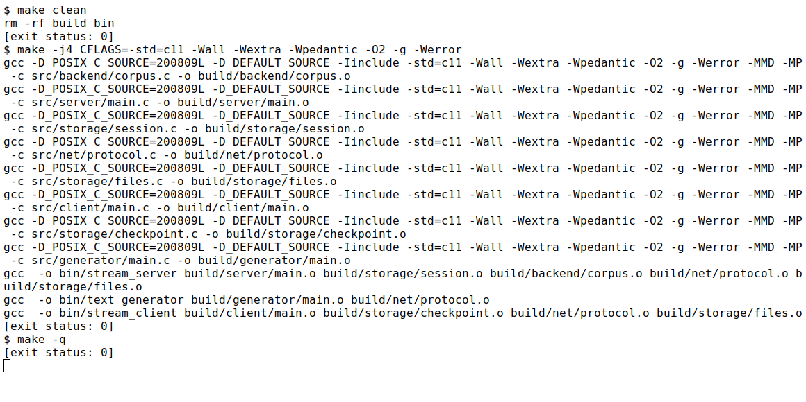
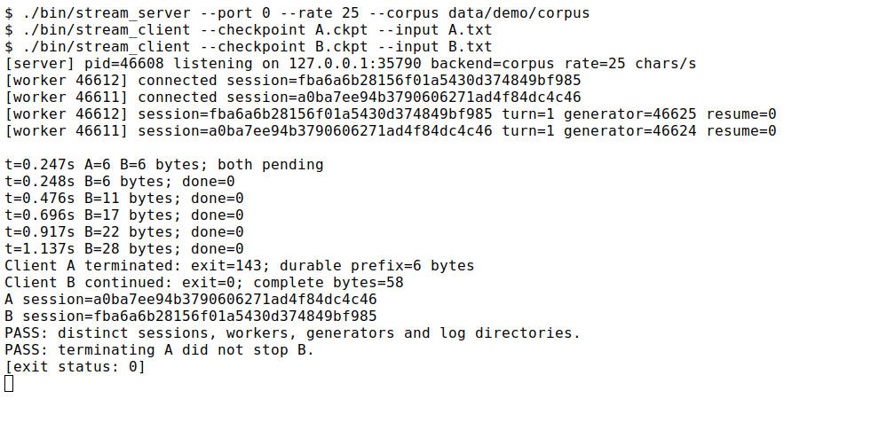
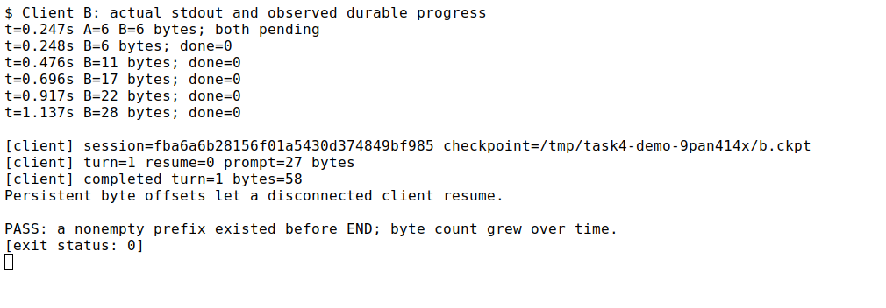
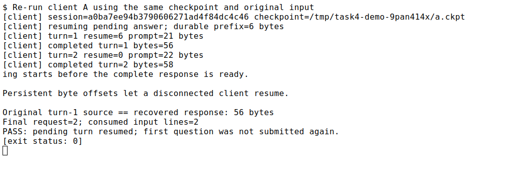
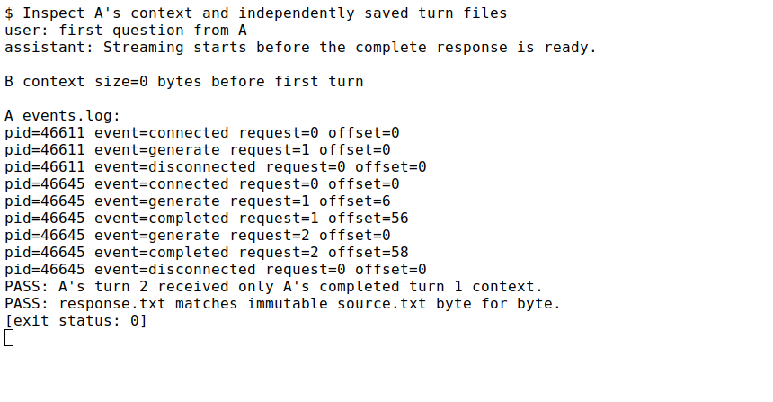
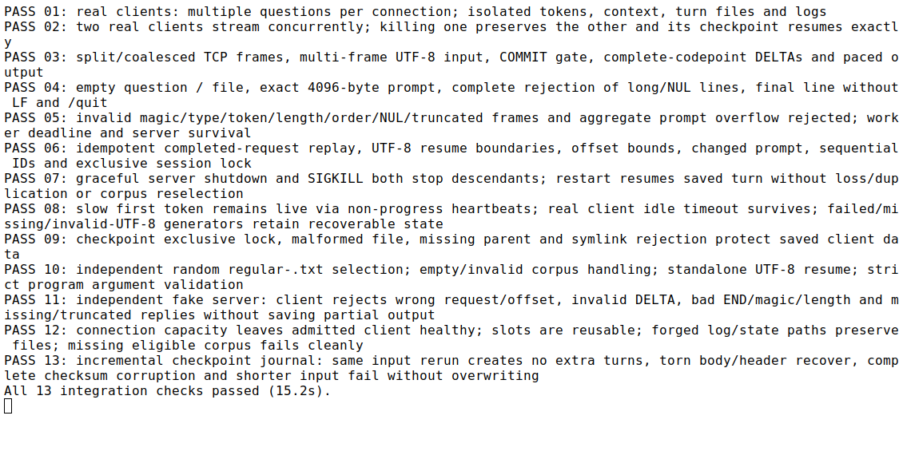

学号：待填写　　姓名：待填写　　专业：待填写　　班级：待填写

# 《Linux操作系统设计实践》实验四：综合应用

实验日期：2026 年 10 月 3 日　　选用方案：方案 2，预留方案 4 扩展接口

## 一、实验环境

| 项目 | 实际环境 |
| --- | --- |
| 操作系统 | Ubuntu 24.04.2 LTS，WSL2 |
| 内核、体系结构 | 6.6.87.2-microsoft-standard-WSL2，x86_64 |
| C 编译器 | GCC 13.3.0 |
| 构建工具 | GNU Make 4.3 |
| 严格编译选项 | `-std=c11 -Wall -Wextra -Wpedantic -O2 -g -Werror` |
| 接口声明 | `_POSIX_C_SOURCE=200809L`、`_DEFAULT_SOURCE`；后端使用 Linux 接口 |
| C 运行依赖 | glibc/POSIX 系统接口，无第三方 C 库 |
| 验证工具 | Python 3.12.3，仅标准库 |
| 运行证据 | 本机回环地址的真实进程；xterm 白底黑字窗口截图 |

实验文件位于 `homework/task4`。以下命令默认在该目录执行。PDF 读取和终端截图工具临时安装在 `/tmp`，不参与 C 程序运行或集成检查。

## 二、系统开发情况介绍

### 2.1 背景、需求与完成范围

实验指导书 PDF 第 7–9 页（印刷页码 5–7）要求方案 2 实现包含服务端、客户端、文本生成程序的流式文本交互系统。用户输入任意内容后，从本地语料随机选取文本，服务端边读取边发送，客户端边接收边显示，文字逐个出现；多个客户端同时提问和输出，一个客户端关闭时其他客户端仍继续，输出、进程和日志互相隔离。语料内容无需与问题相关。

本次以方案 2 完成可运行系统，并按照方案 4 的后续需求组织接口。支持一条连接连续提问；每个会话保存此前完整对话，并将该会话的上下文路径交给生成后端。当前生成器只读取语料，不依据提问或上下文回答，没有部署本地模型，也没有调用外部大模型 API。

| 指导书要求或后续需求 | 实现位置和行为 |
| --- | --- |
| 三类程序 | `bin/stream_server`、`bin/stream_client`、`bin/text_generator` |
| 随机本地语料 | 后端扫描普通 `.txt` 文件，以系统随机源进行独立抽样 |
| 逐字流式输出 | 生成器逐个完整 UTF-8 码点 flush；工作进程逐码点发送；客户端逐码点保存并 flush 显示 |
| 多客户端同时输出 | 主服务进程接受连接，每连接 fork 独立工作进程，再启动独立生成器 |
| 单端关闭隔离 | 工作进程停止自己的生成器，其他工作进程及连接继续处理 |
| 日志与文件读写 | 独立会话目录、问题、语料快照、回答、上下文、事件及生成器日志 |
| 连续对话与上下文 | 请求编号顺序递增；新问题开始前只重建本会话已完成的历史 |
| 低速生成 | 可配置码点速率；生成等待期间发心跳，不设整轮回答总时限 |
| 流式输入接口 | `BEGIN/INPUT/COMMIT` 支持分段上传，提交后开始生成 |
| 中断恢复 | 服务端持久回复缓存，客户端增量 journal，按原请求和已保存字节游标恢复 |

随机抽样各自独立，不保证两客户端每次都选到不同内容。当前客户端按行收集问题后分帧上传，尚未实现逐键输入或模型提前推理。速率单位是 Unicode 码点/秒，与模型 token/s 不同。

### 2.2 进程和模块设计

```text
client A ──TCP── worker A ──pipe── generator A
                   │                 │
                   └── session A     └── generator.log A
server 主进程 ──fork
                   ┌── session B     ┌── generator.log B
client B ──TCP── worker B ──pipe── generator B
```

主进程只监听和管理工作进程。每个工作进程分别持有连接、会话锁和状态文件，通过 `poll` 等待生成管道及客户端断开。生成器 stdout 只传回答，stderr 单独写入当前轮 `generator.log`。父进程结束时，用信号和 `waitpid` 回收子进程；Linux 父进程死亡信号同时覆盖父服务进程被强制终止的情况。

与前三次的扁平组织不同，本次公共声明放在 `include/task4/`，实现按职责放入 `src/` 的子目录。系统库由编译器读取，依赖说明集中在 `deps/`，业务数据、运行状态、测试和证据各有明确位置。完整文件树及调用说明见 [README.md](README.md)，持久化布局见 [docs/architecture.md](docs/architecture.md)。

| 文件/目录 | 作用 |
| --- | --- |
| `include/task4/protocol.h`、`src/net/protocol.c` | 帧格式、完整收发、网络字节序、期限、连接与监听 |
| `include/task4/backend.h`、`src/backend/corpus.c` | 后端接口、语料随机选择、快照、pipe/fork/exec、取消与回收 |
| `src/generator/main.c` | 独立生成程序，UTF-8 检查、逐码点输出、速率和字节偏移 |
| `include/task4/store.h`、`src/storage/session.c` | 会话锁、轮次目录、日志、历史重建和完成标记 |
| `include/task4/files.h`、`src/storage/files.c` | 两端共用的路径、完整文件写入、目录同步，不依赖会话或后端 |
| `include/task4/checkpoint.h`、`src/storage/checkpoint.c` | 客户端恢复 journal、文件锁和残缺尾部修复 |
| `include/task4/text.h` | 完整 UTF-8 码点检查 |
| `src/server/main.c` | 接入并发连接、输入提交、生成转发、心跳、进程管理 |
| `src/client/main.c` | 输入、多轮对话、恢复、逐字显示 |
| `data/corpus/`、`data/demo/corpus/` | 三篇中英混合语料；三篇短英文演示语料 |
| `Makefile`、`deps/README.md` | 三程序构建、自动头文件依赖和依赖说明 |
| `tests/verify.py`、`scripts/` | 集成验证、检查点查看、可复现演示、附录生成 |
| `docs/`、`logs/`、`screenshots/` | 架构协议说明、实测记录、白底终端截图 |

<!-- code-stats:start -->
公共头文件 6 个，C 源文件 8 个，共 2063 行（含注释与空行）。统计不包括 Makefile、Python 辅助脚本、文档和语料。

| 源文件 | 行数 |
| --- | ---: |
| `include/task4/backend.h` | 30 |
| `include/task4/checkpoint.h` | 18 |
| `include/task4/files.h` | 12 |
| `include/task4/protocol.h` | 52 |
| `include/task4/store.h` | 29 |
| `include/task4/text.h` | 22 |
| `src/backend/corpus.c` | 446 |
| `src/client/main.c` | 176 |
| `src/generator/main.c` | 250 |
| `src/net/protocol.c` | 316 |
| `src/server/main.c` | 285 |
| `src/storage/checkpoint.c` | 180 |
| `src/storage/files.c` | 37 |
| `src/storage/session.c` | 210 |
<!-- code-stats:end -->

本报告以单人作业形式组织，未设置小组成员或工作量分配。个人信息由提交者填写。

### 2.3 主要系统调用与文件操作

| 接口 | 本系统用途 |
| --- | --- |
| `socket/bind/listen/accept/connect` | 建立 TCP 服务器和客户端连接 |
| `poll`、`send/recv` | 同时等待管道与连接；处理部分收发、超时和断开 |
| `fork/exec/pipe/dup2` | 每连接独立工作进程；启动独立生成器并隔离回答与诊断 |
| `sigaction/kill/waitpid`、`prctl` | 终止通知、回收进程、父进程死亡清理 |
| `open/read/write/close`、`fgetc/fwrite/fflush` | 语料、提问、回答和日志读写 |
| `flock` | 一个会话或 checkpoint 同时只允许一个连接/进程使用 |
| `fsync/rename/mkstemp/mkdtemp` | 持久文件和原子发布新轮次、客户端元数据 |
| `getrandom`、`/dev/urandom` | 随机语料选择和不可混淆的会话 token |
| `clock_gettime(CLOCK_MONOTONIC)` | 帧传输期限不受系统时钟调整影响 |
| `nanosleep` | 只控制演示输出节奏，不作为进程同步方式 |

### 2.4 协议、流式输出和恢复

TCP 报头为五个 32 位网络序字段：`magic/type/request_id/offset/length`，共 20 字节。问题通过 `BEGIN → INPUT… → COMMIT` 发送；回答通过 `DELTA… → END` 返回。`HEARTBEAT` 只表示连接存活，不计入正文和恢复游标。完整说明见 [docs/protocol.md](docs/protocol.md)。

生成器逐个检查 UTF-8 码点，服务器即使读到半个码点也会先组装再发送。每个 DELTA 含一个完整码点，客户端立即保存、显示和刷新，不等待整篇回答。客户端提问最多 4096 字节，回答最多 16 MiB，默认同时接纳 32 个连接。

服务端先追加并同步完整码点，再发送 DELTA；客户端把 DELTA 追加为带偏移及校验的 journal 记录，同步后显示。新轮次通过临时文件和原子替换保存元数据，回答阶段只追加新记录，因此不会每字符重写全篇。载入时检查记录顺序、校验和码点边界；最后一条记录不完整时截去尾部，完整记录校验错误则拒绝恢复。

重连发送原会话 token、请求编号、原问题和客户端保存字节数。服务器核对原问题，先重放客户端遗漏的缓存，再从本轮固定 `source.txt` 的持久位置继续生成。这样不会重新随机抽取语料，也不会把恢复当成新问题插入历史。批量文件输入保存已消费行数，重跑同一输入文件会跳过这些行。

## 三、程序运行演示说明

### 3.1 编译、增量构建与验证

```sh
make clean
make -j4 CFLAGS='-std=c11 -Wall -Wextra -Wpedantic -O2 -g -Werror'
make verify
make -q
```



真实记录：[logs/01-build.txt](logs/01-build.txt)。三类程序严格编译成功；`make -q` 返回 0，表示产物已更新。`make -n -W include/task4/protocol.h` 的 [依赖计划](logs/build-dependencies.txt) 确认共用头文件更新会重新安排相关模块的编译和链接，未实际改动头文件。

### 3.2 多客户端并发及单端关闭

```sh
# 终端 A
./bin/stream_server --rate 30
# 终端 B
./bin/stream_client --checkpoint state/a.ckpt
# 终端 C
./bin/stream_client --checkpoint state/b.ckpt
```

两个客户端分别提问，在客户端 A 按 Ctrl+C 后观察 B 继续输出。截图演示由 `python3 scripts/demo.py` 启动真实进程，在临时状态目录中使用短演示语料和系统自动分配的端口，输出速率为 25 码点/秒，便于一次截图清楚展示完整证据。



[logs/02-concurrent.txt](logs/02-concurrent.txt) 显示两个不同工作进程与生成器 PID、两个不同会话 token。两端均已产生前缀时终止 A，A 返回 143；B 的字节数继续增长直到完成，返回 0。由此验证主服务和 B 不依赖 A 的生命周期。

### 3.3 逐字流式效果



[logs/03-streaming.txt](logs/03-streaming.txt) 保存客户端 B 的实际输出以及不同时间点的持久字节计数。在 END 前已存在非空前缀，随后计数持续增加，证明不是接收整段后一次性显示。静态截图仅保存运行结果，实时打字机效果可按上面的三个终端命令观察。UTF-8 中文和四字节字符的完整码点行为另外由集成检查验证。

### 3.4 中断恢复与连续提问

```sh
# 恢复后继续交互
./bin/stream_client --checkpoint state/a.ckpt
# 只恢复当前回答，不再读取问题
./bin/stream_client --checkpoint state/a.ckpt --resume-only
# 查看当前轮持久进度或导出完整前缀
python3 scripts/checkpoint.py state/a.ckpt
python3 scripts/checkpoint.py state/a.ckpt --answer > state/a-answer.txt
```



[logs/04-recovery.txt](logs/04-recovery.txt) 中，A 用原 token 和非零游标继续第一轮，随后处理第二轮。演示重跑原输入文件，最终 request=2、file_lines=2，第一条问题没有重复提交。服务端第一轮 `response.txt` 与固定 `source.txt` 逐字节相同；归档回答见 [logs/demo-a-response.txt](logs/demo-a-response.txt)。

已持久化的正文可完整导出；终端恢复显示后缀。若进程恰在保存后、显示前退出，终端历史和磁盘文件不会原子同步，这不影响持久回答完整性。恢复需要同时保留客户端 checkpoint 和服务端会话目录。

### 3.5 文件、日志及上下文隔离



[logs/05-isolation.txt](logs/05-isolation.txt) 和 [logs/demo-a-context.txt](logs/demo-a-context.txt) 显示 A 第二轮只收到 A 第一轮的完整问题与回答；B 首轮上下文为空，没有混入 A 的信息。事件日志分别存于 token 目录。当前生成器不解释上下文，这一实验验证的是历史保存、隔离和传参结构。

### 3.6 自动化验证



[logs/verification.txt](logs/verification.txt) 记录 13 组集成检查全部通过。测试使用 Python 标准库驱动真实 C 程序和独立 TCP 对端，覆盖以下情况：

| 检查重点 | 实测结果 |
| --- | --- |
| 两真实客户端并发、单端退出 | 其他客户端继续；原 checkpoint 可恢复 |
| 多轮、日志和上下文 | 同连接连续问题正确，其他会话内容不混入 |
| TCP 拆包、合包、分段输入 | 报头逐字节拆分仍正确；未 COMMIT 不生成 |
| UTF-8 和节奏 | DELTA 为完整码点，响应前缀在 END 前出现 |
| 输入边界 | 空行、4096 字节、无尾 LF 正确；4097 字节及 NUL 整行跳过 |
| 重放和协议拒绝 | 原请求可重放；改变问题、越界游标、非法顺序和错误帧被拒绝 |
| 服务端恢复 | 优雅结束及父服务 SIGKILL 后，子进程停止；重启继续固定语料 |
| 较长首字等待 | 3.2 秒首字等待超过客户端 1.5 秒帧期限，心跳仍维持连接 |
| 生成器失败 | 缺失程序、非零退出、非法 UTF-8 不被标为完成，保留已有前缀 |
| 文件和锁 | 并发使用同 checkpoint/session 被拒绝，符号链接目标和错误路径不被截断 |
| 增量 journal | 残缺记录尾部回退，完整校验损坏拒绝；原文件重跑不新增轮次 |
| 容量释放 | 满容量拒绝不影响已有会话，旧 worker 结束后连接槽可立即复用 |

## 四、实验结果总结

方案 2 的三个程序、随机语料、即时输出、多客户端并发和会话隔离均已实现，程序实际结果符合指导书要求。前三次作业中的 Make、多文件接口、信号生命周期、IPC 思路和 TCP 文件读写被整合在同一应用中；本次进一步加入请求状态机、心跳和可恢复持久状态。

优点是进程与数据归属明确，流式回复不混入诊断文字；出错后仍可检查原问题、回复前缀和生成器日志。生成后端以小接口接收上下文和恢复位置，不把语料内容写在网络代码里。构建产物、运行状态和证据分目录，方便阅读和增量维护。

当前每完整码点执行持久同步，优先保证可检查的恢复位置，磁盘开销会限制高速输出；后续可以用组提交并明确“已收到”和“已确认持久”的不同位置。每连接和每生成各有进程，默认容量有限，尚未提供推理任务资源调度。token 为会话持有者凭据，当前面向本机实验，没有公网认证与加密。输入文件恢复须沿用相同且内容不变的文件，尚未持久验证文件身份。

方案 4 需要新增本地模型后端，让模型实际读取 `prompt.txt` 和本会话 `context.txt`，支持模型资源约束、上下文窗口和 token 吞吐统计。不能把当前码点节奏称为真实 token/s，也不能把随机语料复制直接当成模型状态。模型若存在随机采样，重启后仅跳过同样字节数不一定得到相同前缀；应设计模型状态保存或能验证前缀一致的恢复办法，再复用现有会话、传输和游标接口。本次按要求只预留结构与接口。

## 五、编程工作总结

本次开发首先重新阅读实验四的指导书，并对照前三次作业的实现和报告。实验四不只是把实验三的大小写转换换成一段文字，它增加了独立文本生成程序、同时服务多个客户端、逐字显示以及关闭单端后其他客户端继续工作的要求。因此在实现前先划分进程和模块责任，再决定怎样表示一条完整问题、怎样传递回答片段，以及哪些数据必须保留到进程退出以后。报告也按照实验四专门规定组织，补充系统组成、主要系统调用、代码量和运行证据。

进程管理方面继续使用 fork、exec 和 waitpid，但本次需要管理两层子进程。主进程负责接入，工作进程负责一个连接，生成器负责一个问题的输出。管道标准输出只承载回答，标准错误单独重定向到生成日志。这样能够在读代码时直接判断某项资源属于谁，也能在客户端退出时只结束对应生成器。为了处理父进程被强制结束的情况，还学习并使用了 Linux 的父进程死亡信号，同时检查设置时的父 PID，避免设置前父进程已经退出的竞态。

网络方面复用了实验三对 TCP 字节流的处理经验。一次接收不是一条消息，长度、类型、请求编号和偏移都必须明确。输入还需要一个提交边界，否则半条问题就可能启动生成。输出不能按任意字节截断中文，因此为完整 UTF-8 码点补充合法性检查。首字等待和总回答时间也不能使用同一个超时概念：生成器可能长时间准备而连接仍然有效，心跳需要维持等待，却不能被当成回答进度。独立的故障生成器测试验证了这些差别。

恢复设计是本次工作中需要反复推敲的部分。最初的客户端实现每来一个字符就重写累计正文，虽然短语料能运行，但长回答的写入量会随长度呈平方增长，不适合以后接入模型。最终改为在新轮次原子发布元数据、在回答阶段追加带偏移和校验的记录。读取检查点时只承认完整记录，尾部写到一半就回退，完整校验错误则明确拒绝。服务端同时固定这一轮的语料快照，防止重连时重新抽样；同一请求还核对原问题，使重试和新一轮对话可以区分。

测试也帮助发现了实际竞态。连接容量最初只在主循环开始时回收进程，如果工作进程在 poll 等待期间退出，新的连接仍可能被旧 PID 占据的槽位误拒绝。修改为接受连接后再次回收，容量立即复用检查才通过。另外，批量输入恢复最初会重新从文件开头读取，造成已经提交的问题再次进入历史，随后增加已消费行数和只恢复模式，并用相同输入文件重跑检查是否新增轮次。这些问题说明正常演示成功还不足以证明恢复和并发正确。

本次保留了实际日志、白底截图和可重复执行的集成脚本，测试结果可以与源文件、持久数据相互核对。系统没有把尚未实现的模型能力写成已经完成，而是明确记录后端入口、上下文归属和后续必须验证的恢复语义。完成后更清楚地认识到，模块化不仅是把文件放进多个目录，还要通过接口、状态机、资源归属和可验证的错误行为，让不同模块能够独立替换、相互配合。

## 六、附录源程序代码

以下附录由 `python3 scripts/render_report.py` 从实际公共头文件、C 源文件、Makefile 和语料自动整理；保留代码注释，与交付文件一致。Python 验证及演示脚本作为辅助源文件随目录提供，可从 README 和对应脚本直接查看。转换 DOCX 时可对本附录缩小行间距或采用两栏排版，保留正文截图的相对路径。

参考资料：实验指导书 PDF 第 7–9 页；`example/task4` 的四类应用示例；`homework/task1`、`task2`、`task3` 的实现、报告与终端截图约定。方案 4 的模型部署参考地址以指导书为准，本次未安装或实测模型。

<!-- source-appendix -->

### 附录 1：include/task4/backend.h

```c
#ifndef TASK4_BACKEND_H
#define TASK4_BACKEND_H

#include <stdint.h>
#include <sys/types.h>

struct t4_generation {
    pid_t pid;
    int fd; /* Nonblocking read end of the generator's stdout pipe. */
};

/*
 * prepare fixes the response source for a durable turn; start may be called
 * again with a byte offset after a disconnect. A future model backend can
 * implement the same interface while using prompt.txt and the context file.
 */
struct t4_backend {
    const char *name;
    int (*prepare)(const char *corpus_dir, const char *turn_dir);
    int (*start)(const char *generator, const char *turn_dir,
                 const char *context_path, uint32_t offset, uint32_t rate,
                 struct t4_generation *generation);
};

extern const struct t4_backend t4_corpus_backend;

/* Closes the pipe, terminates and reaps the child, and sets both fields to -1. */
void t4_generation_stop(struct t4_generation *generation);

#endif
```

### 附录 2：include/task4/checkpoint.h

```c
#ifndef TASK4_CHECKPOINT_H
#define TASK4_CHECKPOINT_H
#include "task4/protocol.h"

struct t4_checkpoint {
    char session[33];
    uint32_t request, offset, prompt_length, done;
    uint32_t file_lines;
    unsigned char prompt[T4_MAX_PROMPT + 1];
    unsigned char *answer;
    uint32_t saved_request, saved_offset, saved_done;
    int journal_loaded;
};
int t4_checkpoint_load(const char *path, struct t4_checkpoint *c);
int t4_checkpoint_save(const char *path, struct t4_checkpoint *c);
int t4_checkpoint_lock(const char *path);

#endif
```

### 附录 3：include/task4/files.h

```c
#ifndef TASK4_FILES_H
#define TASK4_FILES_H

#include <limits.h>
#include <stddef.h>

/* 两侧共有的文件工具，不依赖服务端会话或生成后端。 */
int t4_path(char result[PATH_MAX], const char *directory, const char *name);
int t4_write_all(int fd, const void *data, size_t length);
int t4_directory_sync(const char *directory);

#endif
```

### 附录 4：include/task4/protocol.h

```c
#ifndef TASK4_PROTOCOL_H
#define TASK4_PROTOCOL_H

#include <stdint.h>

/* Five network-order uint32_t fields form the fixed 20-byte header. */
#define T4_MAGIC UINT32_C(0x54345331)
#define T4_MAX_FRAME UINT32_C(4096)
#define T4_MAX_PROMPT UINT32_C(4096)
#define T4_MAX_RESPONSE UINT32_C(16777216)

enum t4_frame_type {
    T4_HELLO = 1,
    T4_WELCOME = 2,
    T4_BEGIN = 3,
    T4_INPUT = 4,
    T4_COMMIT = 5,
    T4_DELTA = 6,
    T4_END = 7,
    T4_ERROR = 8,
    T4_HEARTBEAT = 9
};

struct t4_frame {
    uint32_t type;
    uint32_t request_id;
    uint32_t offset;
    uint32_t length;
    unsigned char data[T4_MAX_FRAME + 1U];
};

/*
 * A complete frame has a monotonic-clock deadline of idle_ms milliseconds.
 * Partial transfers are completed internally. EINTR is returned to the caller
 * so a signal handler can ask its event loop to stop. Payloads are raw bytes;
 * applications must check their own text and state-machine requirements.
 */
/* Returns 1 for a complete send, and -1 on error. */
int t4_send(int fd, const struct t4_frame *frame, int idle_ms);
/* Returns 1 for a frame, 0 only for EOF between frames, and -1 on error. */
int t4_recv(int fd, struct t4_frame *frame, int idle_ms);

/* Returned sockets are nonblocking, close-on-exec, and use TCP_NODELAY. */
int t4_connect(const char *host, uint16_t port, int idle_ms);
/* IPv4 only; a NULL bind address selects 127.0.0.1. Port 0 selects a free port. */
int t4_listen(const char *bind_ipv4, uint16_t port, uint16_t *actual_port);

/* Strict unsigned decimal parsing: no signs, whitespace, or trailing text. */
int t4_uint(const char *text, uint32_t minimum, uint32_t maximum,
            uint32_t *value);

#endif
```

### 附录 5：include/task4/store.h

```c
#ifndef TASK4_STORE_H
#define TASK4_STORE_H

#include <limits.h>
#include <stdint.h>
#include <stddef.h>
#include "task4/backend.h"
#include "task4/files.h"

struct t4_session {
    char token[33];
    char directory[PATH_MAX];
    char context[PATH_MAX];
    int lock_fd;
    int log_fd;
};

/* 同一会话只允许一个连接持有锁；空 token 创建独立会话。 */
int t4_session_open(const char *root, const char *token, struct t4_session *s);
void t4_session_close(struct t4_session *s);
int t4_event(struct t4_session *s, const char *event, uint32_t request, uint32_t offset);
/* 检查顺序及重试 prompt，返回持久回复长度、完成标志和本轮目录。 */
int t4_turn_open(struct t4_session *s, uint32_t request,
                 const unsigned char *prompt, uint32_t length,
                 char directory[PATH_MAX], uint32_t *cached, int *done,
                 const char *corpus, const struct t4_backend *backend);
int t4_turn_done(const char *directory);

#endif
```

### 附录 6：include/task4/text.h

```c
#ifndef TASK4_TEXT_H
#define TASK4_TEXT_H
#include <stddef.h>

/* 检查一个完整 Unicode 码点；不允许过长编码、代理项或超出 U+10FFFF。 */
static inline unsigned t4_character_width(unsigned char c)
{
    if (c >= 1 && c <= 0x7f) return 1;
    if (c >= 0xc2 && c <= 0xdf) return 2;
    if (c >= 0xe0 && c <= 0xef) return 3;
    if (c >= 0xf0 && c <= 0xf4) return 4;
    return 0;
}
static inline int t4_character_valid(const unsigned char *p, size_t n)
{
    if (n == 0 || n != t4_character_width(p[0])) return 0;
    for (size_t i = 1; i < n; ++i) if (p[i] < 0x80 || p[i] > 0xbf) return 0;
    if (n == 3 && ((p[0] == 0xe0 && p[1] < 0xa0) || (p[0] == 0xed && p[1] >= 0xa0))) return 0;
    if (n == 4 && ((p[0] == 0xf0 && p[1] < 0x90) || (p[0] == 0xf4 && p[1] >= 0x90))) return 0;
    return 1;
}
#endif
```

### 附录 7：src/backend/corpus.c

```c
#define _GNU_SOURCE

#include "task4/backend.h"
#include "task4/protocol.h"

#include <dirent.h>
#include <errno.h>
#include <fcntl.h>
#include <limits.h>
#include <signal.h>
#include <stdint.h>
#include <stdio.h>
#include <stdlib.h>
#include <string.h>
#include <sys/random.h>
#include <sys/prctl.h>
#include <sys/stat.h>
#include <sys/types.h>
#include <sys/wait.h>
#include <unistd.h>

static int random_bytes(void *destination, size_t length)
{
    unsigned char *bytes = destination;
    size_t done = 0;
    int fallback = -1;

    while (done < length) {
        ssize_t count = getrandom(bytes + done, length - done, 0);

        if (count > 0) {
            done += (size_t)count;
        } else if (count == -1 && errno == ENOSYS) {
            fallback = open("/dev/urandom", O_RDONLY | O_CLOEXEC);
            break;
        } else {
            if (count == 0) {
                errno = EIO;
            }
            return -1;
        }
    }
    if (done == length) {
        return 0;
    }
    if (fallback == -1) {
        return -1;
    }
    while (done < length) {
        ssize_t count = read(fallback, bytes + done, length - done);

        if (count <= 0) {
            int saved_error = count == 0 ? EIO : errno;

            (void)close(fallback);
            errno = saved_error;
            return -1;
        }
        done += (size_t)count;
    }
    return close(fallback);
}

static int uniform_below(uint64_t limit, uint64_t *value)
{
    uint64_t random_value;
    uint64_t threshold = (uint64_t)(-limit) % limit;

    /* Rejection sampling avoids modulo bias, including in reservoir selection. */
    do {
        if (random_bytes(&random_value, sizeof(random_value)) == -1) {
            return -1;
        }
    } while (random_value < threshold);
    *value = random_value % limit;
    return 0;
}

static int select_source(const char *corpus_dir)
{
    DIR *directory = opendir(corpus_dir);
    struct dirent *entry;
    uint64_t candidates = 0;
    int selected = -1;
    int failure = 0;

    if (directory == NULL) {
        return -1;
    }
    for (;;) {
        size_t name_length;
        struct stat metadata;
        uint64_t pick;

        errno = 0;
        entry = readdir(directory);
        if (entry == NULL) {
            failure = errno;
            break;
        }
        name_length = strlen(entry->d_name);
        if (name_length < 4
            || strcmp(entry->d_name + name_length - 4, ".txt") != 0) {
            continue;
        }
        if (fstatat(dirfd(directory), entry->d_name, &metadata,
                    AT_SYMLINK_NOFOLLOW) == -1) {
            failure = errno;
            break;
        }
        if (!S_ISREG(metadata.st_mode)) {
            continue;
        }
        if (candidates == UINT64_MAX) {
            failure = EOVERFLOW;
            break;
        }
        candidates++;
        if (uniform_below(candidates, &pick) == -1) {
            failure = errno;
            break;
        }
        if (pick == 0) {
            int candidate = openat(dirfd(directory), entry->d_name,
                                   O_RDONLY | O_CLOEXEC | O_NOFOLLOW);

            if (candidate == -1) {
                failure = errno;
                break;
            }
            if (fstat(candidate, &metadata) == -1) {
                failure = errno;
                (void)close(candidate);
                break;
            }
            if (!S_ISREG(metadata.st_mode)) {
                failure = EINVAL;
                (void)close(candidate);
                break;
            }
            if (selected != -1) {
                (void)close(selected);
            }
            selected = candidate;
        }
    }
    if (closedir(directory) == -1 && failure == 0) {
        failure = errno;
    }
    if (failure == 0 && candidates == 0) {
        failure = ENOENT;
    }
    if (failure != 0) {
        if (selected != -1) {
            (void)close(selected);
        }
        errno = failure;
        return -1;
    }
    return selected;
}

static int copy_source(int source, int destination)
{
    unsigned char buffer[16384];
    uint32_t total = 0;
    struct stat metadata;

    if (fstat(source, &metadata) == -1) {
        return -1;
    }
    if (metadata.st_size < 0 || metadata.st_size > (off_t)T4_MAX_RESPONSE) {
        errno = EFBIG;
        return -1;
    }
    for (;;) {
        ssize_t count = read(source, buffer, sizeof(buffer));
        size_t done = 0;

        if (count == -1) {
            return -1;
        }
        if (count == 0) {
            return 0;
        }
        if ((uint32_t)count > T4_MAX_RESPONSE - total) {
            errno = EFBIG;
            return -1;
        }
        total += (uint32_t)count;
        while (done < (size_t)count) {
            ssize_t written = write(destination, buffer + done,
                                    (size_t)count - done);

            if (written <= 0) {
                if (written == 0) {
                    errno = EIO;
                }
                return -1;
            }
            done += (size_t)written;
        }
    }
}

static int corpus_prepare(const char *corpus_dir, const char *turn_dir)
{
    int source;
    int directory;
    int destination;
    int saved_error;
    int result;
    char temporary[48];
    uint64_t random_suffix;

    if (corpus_dir == NULL || turn_dir == NULL) {
        errno = EINVAL;
        return -1;
    }
    source = select_source(corpus_dir);
    if (source == -1) {
        return -1;
    }
    directory = open(turn_dir, O_RDONLY | O_DIRECTORY | O_CLOEXEC);
    if (directory == -1) {
        saved_error = errno;
        (void)close(source);
        errno = saved_error;
        return -1;
    }
    if (random_bytes(&random_suffix, sizeof(random_suffix)) == -1) {
        saved_error = errno;
        (void)close(directory);
        (void)close(source);
        errno = saved_error;
        return -1;
    }
    (void)snprintf(temporary, sizeof(temporary), "source.tmp.%016llx",
                   (unsigned long long)random_suffix);
    destination = openat(directory, temporary,
                         O_WRONLY | O_CREAT | O_EXCL | O_CLOEXEC | O_NOFOLLOW,
                         0600);
    if (destination == -1) {
        saved_error = errno;
        (void)close(directory);
        (void)close(source);
        errno = saved_error;
        return -1;
    }
    result = copy_source(source, destination);
    saved_error = errno;
    if (result == 0 && fsync(destination) == -1) {
        result = -1;
        saved_error = errno;
    }
    if (close(destination) == -1 && result == 0) {
        result = -1;
        saved_error = errno;
    }
    (void)close(source);
    if (result == 0
        && renameat(directory, temporary, directory, "source.txt") == -1) {
        result = -1;
        saved_error = errno;
    }
    if (result == 0 && fsync(directory) == -1) {
        result = -1;
        saved_error = errno;
    }
    if (result == -1) {
        (void)unlinkat(directory, temporary, 0);
    }
    (void)close(directory);
    errno = saved_error;
    return result;
}

static int join_path(char *buffer, size_t capacity, const char *directory,
                     const char *name)
{
    int length = snprintf(buffer, capacity, "%s/%s", directory, name);

    if (length < 0 || (size_t)length >= capacity) {
        errno = ENAMETOOLONG;
        return -1;
    }
    return 0;
}

static void restore_child_signals(void)
{
    const int signals[] = { SIGTERM, SIGINT, SIGHUP, SIGPIPE };
    struct sigaction action;
    sigset_t mask;
    size_t index;

    memset(&action, 0, sizeof(action));
    action.sa_handler = SIG_DFL;
    (void)sigemptyset(&action.sa_mask);
    for (index = 0; index < sizeof(signals) / sizeof(signals[0]); index++) {
        if (sigaction(signals[index], &action, NULL) == -1) {
            _exit(126);
        }
    }
    (void)sigemptyset(&mask);
    if (sigprocmask(SIG_SETMASK, &mask, NULL) == -1) {
        _exit(126);
    }
}

static int corpus_start(const char *generator, const char *turn_dir,
                        const char *context_path, uint32_t offset, uint32_t rate,
                        struct t4_generation *generation)
{
    char source[PATH_MAX];
    char prompt[PATH_MAX];
    char log_path[PATH_MAX];
    char offset_text[11];
    char rate_text[11];
    int pipe_fds[2];
    int log_fd;
    int flags;
    int saved_error;
    pid_t child;
    pid_t parent;

    if (generator == NULL || *generator == '\0' || turn_dir == NULL
        || context_path == NULL || generation == NULL
        || offset > T4_MAX_RESPONSE || rate > 10000U) {
        errno = EINVAL;
        return -1;
    }
    generation->pid = -1;
    generation->fd = -1;
    if (join_path(source, sizeof(source), turn_dir, "source.txt") == -1
        || join_path(prompt, sizeof(prompt), turn_dir, "prompt.txt") == -1
        || join_path(log_path, sizeof(log_path), turn_dir, "generator.log") == -1) {
        return -1;
    }
    (void)snprintf(offset_text, sizeof(offset_text), "%u", (unsigned int)offset);
    (void)snprintf(rate_text, sizeof(rate_text), "%u", (unsigned int)rate);
    if (pipe2(pipe_fds, O_CLOEXEC) == -1) {
        return -1;
    }
    flags = fcntl(pipe_fds[0], F_GETFL);
    if (flags == -1 || fcntl(pipe_fds[0], F_SETFL, flags | O_NONBLOCK) == -1) {
        saved_error = errno;
        (void)close(pipe_fds[0]);
        (void)close(pipe_fds[1]);
        errno = saved_error;
        return -1;
    }
    log_fd = open(log_path, O_WRONLY | O_CREAT | O_APPEND | O_CLOEXEC | O_NOFOLLOW,
                  0600);
    if (log_fd == -1) {
        saved_error = errno;
        (void)close(pipe_fds[0]);
        (void)close(pipe_fds[1]);
        errno = saved_error;
        return -1;
    }
    parent = getpid();
    child = fork();
    if (child == -1) {
        saved_error = errno;
        (void)close(log_fd);
        (void)close(pipe_fds[0]);
        (void)close(pipe_fds[1]);
        errno = saved_error;
        return -1;
    }
    if (child == 0) {
        int null_input;

        restore_child_signals();
        /* A crashed worker must not leave its generator running in the background. */
        if (prctl(PR_SET_PDEATHSIG, SIGTERM) == -1 || getppid() != parent) {
            _exit(126);
        }
        (void)close(pipe_fds[0]);
        null_input = open("/dev/null", O_RDONLY);
        if (null_input == -1 || dup2(null_input, STDIN_FILENO) == -1
            || dup2(pipe_fds[1], STDOUT_FILENO) == -1
            || dup2(log_fd, STDERR_FILENO) == -1
            || fcntl(STDIN_FILENO, F_SETFD, 0) == -1
            || fcntl(STDOUT_FILENO, F_SETFD, 0) == -1
            || fcntl(STDERR_FILENO, F_SETFD, 0) == -1) {
            _exit(126);
        }
        if (null_input != STDIN_FILENO) {
            (void)close(null_input);
        }
        if (pipe_fds[1] != STDOUT_FILENO) {
            (void)close(pipe_fds[1]);
        }
        if (log_fd != STDERR_FILENO) {
            (void)close(log_fd);
        }
        execlp(generator, generator, "--source", source, "--prompt", prompt,
               "--context", context_path, "--offset", offset_text,
               "--rate", rate_text, (char *)NULL);
        (void)dprintf(STDERR_FILENO, "exec generator: %s\n", strerror(errno));
        _exit(127);
    }
    (void)close(log_fd);
    (void)close(pipe_fds[1]);
    generation->pid = child;
    generation->fd = pipe_fds[0];
    return 0;
}

const struct t4_backend t4_corpus_backend = {
    .name = "corpus",
    .prepare = corpus_prepare,
    .start = corpus_start
};

void t4_generation_stop(struct t4_generation *generation)
{
    int saved_error = errno;

    if (generation == NULL) {
        return;
    }
    if (generation->fd >= 0) {
        (void)close(generation->fd);
        generation->fd = -1;
    }
    if (generation->pid > 0) {
        pid_t reaped;

        (void)kill(generation->pid, SIGTERM);
        do {
            reaped = waitpid(generation->pid, NULL, WNOHANG);
        } while (reaped == -1 && errno == EINTR);
        if (reaped == 0) {
            /* Cancellation must stay bounded even for a future misbehaving backend. */
            (void)kill(generation->pid, SIGKILL);
            while (waitpid(generation->pid, NULL, 0) == -1 && errno == EINTR) {
                /* Reap even when a second shutdown signal interrupts waitpid. */
            }
        }
    }
    generation->pid = -1;
    errno = saved_error;
}
```

### 附录 8：src/client/main.c

```c
#include "task4/checkpoint.h"
#include "task4/protocol.h"
#include "task4/text.h"

#include <errno.h>
#include <signal.h>
#include <stdio.h>
#include <stdlib.h>
#include <string.h>
#include <unistd.h>

static volatile sig_atomic_t stopped;
static void stop_signal(int signo) { stopped = signo; }

static int send_frame(int fd, uint32_t type, uint32_t request, uint32_t offset,
                      const void *data, uint32_t length, int idle)
{
    struct t4_frame frame = {.type = type, .request_id = request,
                             .offset = offset, .length = length};
    if (length) memcpy(frame.data, data, length);
    return t4_send(fd, &frame, idle);
}

static int ask(int fd, const char *path, struct t4_checkpoint *c, int idle)
{
    if (send_frame(fd, T4_BEGIN, c->request, c->offset, NULL, 0, idle) < 0) return -1;
    for (uint32_t offset = 0; offset < c->prompt_length;) {
        uint32_t n = c->prompt_length - offset;
        if (n > 128) n = 128;
        if (send_frame(fd, T4_INPUT, c->request, offset, c->prompt + offset, n, idle) < 0) return -1;
        offset += n;
    }
    if (send_frame(fd, T4_COMMIT, c->request, c->prompt_length, NULL, 0, idle) < 0) return -1;
    fprintf(stderr, "[client] turn=%u resume=%u prompt=%u bytes\n", c->request, c->offset, c->prompt_length);
    struct t4_frame frame;
    for (;;) {
        if (t4_recv(fd, &frame, idle) != 1) return -1;
        if (frame.type == T4_ERROR) {
            fprintf(stderr, "[server error] %.*s\n", (int)frame.length, frame.data);
            errno = EPROTO; return -1;
        }
        if (frame.request_id != c->request || frame.offset != c->offset) {
            errno = EPROTO; return -1;
        }
        if (frame.type == T4_HEARTBEAT && !frame.length) continue;
        if (frame.type == T4_END && !frame.length) {
            c->done = 1;
            if (t4_checkpoint_save(path, c) < 0) return -1;
            if (fputc('\n', stdout) == EOF || fflush(stdout) == EOF) return -1;
            fprintf(stderr, "[client] completed turn=%u bytes=%u\n", c->request, c->offset);
            return 0;
        }
        if (frame.type != T4_DELTA || !t4_character_valid(frame.data, frame.length) ||
            frame.length > T4_MAX_RESPONSE - c->offset) { errno = EPROTO; return -1; }
        memcpy(c->answer + c->offset, frame.data, frame.length);
        c->offset += frame.length;
        /* 游标与完整正文先落盘；终端不是持久介质，恢复只打印尚未保存的后缀。 */
        if (t4_checkpoint_save(path, c) < 0 ||
            fwrite(frame.data, 1, frame.length, stdout) != frame.length || fflush(stdout) == EOF)
            return -1;
        if (stopped) return -1;
    }
}

/* 消费超长/NUL整行，尾部不会被错误地变成下一条问题。 */
static int read_prompt(FILE *input, struct t4_checkpoint *c)
{
    int byte, invalid = 0, any = 0;
    c->prompt_length = 0;
    while ((byte = fgetc(input)) != EOF && byte != '\n') {
        any = 1;
        if (!byte || c->prompt_length == T4_MAX_PROMPT) invalid = 1;
        else c->prompt[c->prompt_length++] = (unsigned char)byte;
    }
    c->prompt[c->prompt_length] = 0;
    if (ferror(input)) return -1;
    if (invalid) return -2;
    return byte == EOF && !any ? 0 : 1;
}

int main(int argc, char **argv)
{
    const char *host = "127.0.0.1", *path = "state/client.ckpt", *input_path = NULL;
    uint32_t port = 3340, idle = 10000;
    int resume_only = 0;
    for (int i = 1; i < argc; ++i) {
        if (!strcmp(argv[i], "--resume-only")) { resume_only = 1; continue; }
        if (i + 1 == argc) goto usage;
        const char *key = argv[i], *value = argv[++i];
        if (!strcmp(key, "--host")) host = value;
        else if (!strcmp(key, "--checkpoint")) path = value;
        else if (!strcmp(key, "--input")) input_path = value;
        else if (!strcmp(key, "--port")) { if (t4_uint(value, 1, 65535, &port) < 0) goto usage; }
        else if (!strcmp(key, "--idle-ms")) { if (t4_uint(value, 1500, 3600000, &idle) < 0) goto usage; }
        else goto usage;
    }
    struct sigaction action = {0};
    action.sa_handler = stop_signal;
    sigemptyset(&action.sa_mask);
    if (sigaction(SIGINT, &action, NULL) < 0 || sigaction(SIGTERM, &action, NULL) < 0) {
        perror("sigaction"); return 1;
    }
    struct t4_checkpoint c = {0};
    c.answer = malloc(T4_MAX_RESPONSE);
    if (!c.answer) { perror("malloc"); return 1; }
    int lock = -1, fd = -1, result = 1;
    FILE *input = stdin;
    lock = t4_checkpoint_lock(path);
    if (lock < 0 || t4_checkpoint_load(path, &c) < 0) { perror("checkpoint open/lock"); goto cleanup; }
    if (input_path && !(input = fopen(input_path, "r"))) { perror("input"); goto cleanup; }
    if (input_path && !resume_only) {
        /* 批量输入恢复沿用原文件，跳过已持久提交的整行，不重复提问。 */
        for (uint32_t line = 0; line < c.file_lines; ++line) {
            int byte, any = 0;
            while ((byte = fgetc(input)) != EOF && byte != '\n') any = 1;
            if (ferror(input) || (byte == EOF && !any)) { errno = EINVAL; goto failure; }
        }
    }
    fd = t4_connect(host, (uint16_t)port, (int)idle);
    if (fd < 0) { perror("connect (start server first)"); goto cleanup; }
    if (send_frame(fd, T4_HELLO, 0, 0, c.session, (uint32_t)strlen(c.session), (int)idle) < 0)
        goto failure;
    struct t4_frame welcome;
    if (t4_recv(fd, &welcome, (int)idle) != 1) goto failure;
    if (welcome.type == T4_ERROR) {
        fprintf(stderr, "[server error] %.*s\n", (int)welcome.length, welcome.data);
        goto cleanup;
    }
    if (welcome.type != T4_WELCOME || welcome.request_id || welcome.offset || welcome.length != 32)
        goto failure;
    for (uint32_t i = 0; i < 32; ++i) {
        unsigned char b = welcome.data[i];
        if (!((b >= '0' && b <= '9') || (b >= 'a' && b <= 'f'))) goto failure;
    }
    if (c.session[0] && memcmp(c.session, welcome.data, 32)) goto failure;
    memcpy(c.session, welcome.data, 32); c.session[32] = 0;
    if (t4_checkpoint_save(path, &c) < 0) goto failure;
    fprintf(stderr, "[client] session=%s checkpoint=%s\n", c.session, path);
    if (!c.done) {
        fprintf(stderr, "[client] resuming pending answer; durable prefix=%u bytes\n", c.offset);
        if (ask(fd, path, &c, (int)idle) < 0) goto failure;
    }
    if (resume_only) { result = 0; goto cleanup; }
    while (!stopped) {
        if (input == stdin && isatty(STDIN_FILENO)) {
            fprintf(stderr, "question (/quit to exit)> "); fflush(stderr);
        }
        int received = read_prompt(input, &c);
        if (!received) { result = 0; break; }
        if (input_path) ++c.file_lines;
        if (received == -1) goto failure;
        if (received == -2) {
            fprintf(stderr, "[client] invalid line skipped (max %u bytes, no NUL).\n", T4_MAX_PROMPT);
            continue;
        }
        if (c.prompt_length == 5 && !memcmp(c.prompt, "/quit", 5)) { result = 0; break; }
        if (c.request >= 10000) { errno = EOVERFLOW; goto failure; }
        ++c.request;
        c.offset = 0; c.done = 0;
        if (t4_checkpoint_save(path, &c) < 0 || ask(fd, path, &c, (int)idle) < 0) goto failure;
    }
    goto cleanup;
failure:
    if (!errno) errno = EPROTO;
    perror("stream/checkpoint (rerun with the same checkpoint to resume)");
cleanup:
    if (fd >= 0) close(fd);
    if (lock >= 0) close(lock);
    if (input && input != stdin && fclose(input) == EOF) result = 1;
    free(c.answer);
    return stopped ? 128 + stopped : result;
usage:
    fprintf(stderr, "Usage: %s [--host HOST] [--port 1..65535] [--checkpoint FILE]\n"
                    "  [--input FILE] [--resume-only] [--idle-ms 1500..3600000]\n", argv[0]);
    return 2;
}
```

### 附录 9：src/generator/main.c

```c
#define _POSIX_C_SOURCE 200809L

#include "task4/protocol.h"

#include <errno.h>
#include <stdint.h>
#include <stdio.h>
#include <string.h>
#include <sys/stat.h>
#include <time.h>
#include <unistd.h>

struct options {
    const char *source;
    const char *prompt;
    const char *context;
    uint32_t offset;
    uint32_t rate;
};

static void usage(const char *program)
{
    (void)fprintf(stderr,
                  "Usage: %s --source FILE [--prompt FILE] [--context FILE]\n"
                  "          [--offset BYTE_OFFSET] [--rate 0..10000]\n"
                  "The corpus backend ignores prompt/context content.\n"
                  "Rate 0 streams immediately; other rates are Unicode characters/s.\n",
                  program);
}

static int parse_options(int argc, char **argv, struct options *options)
{
    int index;
    unsigned int seen = 0;

    options->source = NULL;
    options->prompt = NULL;
    options->context = NULL;
    options->offset = 0;
    options->rate = 30;
    for (index = 1; index < argc; index++) {
        const char *name = argv[index];
        const char *value;
        unsigned int bit;

        if (strcmp(name, "--help") == 0 && argc == 2) {
            usage(argv[0]);
            return 1;
        }
        if (index + 1 >= argc) {
            return -1;
        }
        value = argv[++index];
        if (*value == '\0') {
            return -1;
        }
        if (strcmp(name, "--source") == 0) {
            bit = 1U;
            options->source = value;
        } else if (strcmp(name, "--prompt") == 0) {
            bit = 2U;
            options->prompt = value;
        } else if (strcmp(name, "--context") == 0) {
            bit = 4U;
            options->context = value;
        } else if (strcmp(name, "--offset") == 0) {
            bit = 8U;
            if (t4_uint(value, 0, T4_MAX_RESPONSE, &options->offset) == -1) {
                return -1;
            }
        } else if (strcmp(name, "--rate") == 0) {
            bit = 16U;
            if (t4_uint(value, 0, 10000, &options->rate) == -1) {
                return -1;
            }
        } else {
            return -1;
        }
        if ((seen & bit) != 0) {
            return -1;
        }
        seen |= bit;
    }
    return options->source == NULL ? -1 : 0;
}

/* Return one strictly valid UTF-8 code point, 0 for clean EOF, or -1. */
static int read_character(FILE *source, unsigned char bytes[4], size_t *length)
{
    int first = fgetc(source);
    size_t expected;
    size_t index;

    if (first == EOF) {
        if (ferror(source)) {
            if (errno == 0) {
                errno = EIO;
            }
            return -1;
        }
        return 0;
    }
    bytes[0] = (unsigned char)first;
    if (first >= 1 && first <= 0x7f) {
        expected = 1;
    } else if (first >= 0xc2 && first <= 0xdf) {
        expected = 2;
    } else if (first >= 0xe0 && first <= 0xef) {
        expected = 3;
    } else if (first >= 0xf0 && first <= 0xf4) {
        expected = 4;
    } else {
        errno = EILSEQ;
        return -1;
    }
    for (index = 1; index < expected; index++) {
        int next = fgetc(source);

        if (next == EOF) {
            if (!ferror(source) || errno == 0) {
                errno = EILSEQ;
            }
            return -1;
        }
        if (next < 0x80 || next > 0xbf) {
            errno = EILSEQ;
            return -1;
        }
        bytes[index] = (unsigned char)next;
    }
    /* Exclude overlong forms, surrogate code points, and values above U+10FFFF. */
    if ((first == 0xe0 && bytes[1] < 0xa0)
        || (first == 0xed && bytes[1] > 0x9f)
        || (first == 0xf0 && bytes[1] < 0x90)
        || (first == 0xf4 && bytes[1] > 0x8f)) {
        errno = EILSEQ;
        return -1;
    }
    *length = expected;
    return 1;
}

static int stream_source(FILE *source, const struct options *options)
{
    unsigned char character[4];
    uint32_t consumed = 0;
    unsigned int emitted = 0;
    struct timespec interval = { .tv_sec = 0, .tv_nsec = 0 };
    int result;

    if (options->rate != 0) {
        interval.tv_sec = 1 / options->rate;
        interval.tv_nsec = (long)(1000000000U / options->rate
                                 - (uint32_t)interval.tv_sec * 1000000000U);
    }
    for (;;) {
        size_t length;

        result = read_character(source, character, &length);
        if (result != 1) {
            break;
        }
        if (length > T4_MAX_RESPONSE - consumed) {
            errno = EFBIG;
            return 1;
        }
        if (consumed < options->offset
            && consumed + (uint32_t)length > options->offset) {
            (void)fprintf(stderr, "offset must lie on a UTF-8 character boundary\n");
            return 2;
        }
        if (consumed >= options->offset) {
            /* Only pacing uses sleep. I/O and server scheduling use blocking/poll. */
            if (emitted != 0 && options->rate != 0) {
                if (nanosleep(&interval, NULL) == -1) {
                    return 1;
                }
            }
            if (fwrite(character, 1, length, stdout) != length
                || fflush(stdout) == EOF) {
                return 1;
            }
            emitted = 1;
        }
        consumed += (uint32_t)length;
    }
    if (result == -1) {
        return 1;
    }
    if (consumed < options->offset) {
        (void)fprintf(stderr, "offset exceeds the source length\n");
        return 2;
    }
    return 0;
}

int main(int argc, char **argv)
{
    struct options options;
    struct stat metadata;
    FILE *source;
    int parsed = parse_options(argc, argv, &options);
    int result;

    if (parsed == 1) {
        return 0;
    }
    if (parsed == -1) {
        usage(argv[0]);
        return 2;
    }
    source = fopen(options.source, "rb");
    if (source == NULL) {
        perror("open source");
        return 1;
    }
    if (fstat(fileno(source), &metadata) == -1) {
        perror("stat source");
        (void)fclose(source);
        return 1;
    }
    if (!S_ISREG(metadata.st_mode) || metadata.st_size < 0
        || metadata.st_size > (off_t)T4_MAX_RESPONSE) {
        (void)fprintf(stderr, "source must be a regular file of at most %u bytes\n",
                      (unsigned int)T4_MAX_RESPONSE);
        (void)fclose(source);
        return 1;
    }
    if ((off_t)options.offset > metadata.st_size) {
        (void)fprintf(stderr, "offset exceeds the source length\n");
        (void)fclose(source);
        return 2;
    }
    (void)fprintf(stderr,
                  "backend=corpus source=%s offset=%u rate=%u characters/s\n"
                  "prompt=%s context=%s (reserved for future backends)\n",
                  options.source, (unsigned int)options.offset,
                  (unsigned int)options.rate,
                  options.prompt == NULL ? "(none)" : options.prompt,
                  options.context == NULL ? "(none)" : options.context);
    result = stream_source(source, &options);
    if (result == 1) {
        perror("stream source");
    }
    if (fclose(source) == EOF && result == 0) {
        perror("close source");
        result = 1;
    }
    return result;
}
```

### 附录 10：src/net/protocol.c

```c
#define _POSIX_C_SOURCE 200809L

#include "task4/protocol.h"

#include <arpa/inet.h>
#include <errno.h>
#include <fcntl.h>
#include <limits.h>
#include <netdb.h>
#include <netinet/tcp.h>
#include <poll.h>
#include <stddef.h>
#include <stdio.h>
#include <string.h>
#include <sys/socket.h>
#include <time.h>
#include <unistd.h>

static int deadline_after(int milliseconds, struct timespec *deadline)
{
    if (milliseconds <= 0) {
        errno = EINVAL;
        return -1;
    }
    if (clock_gettime(CLOCK_MONOTONIC, deadline) == -1) {
        return -1;
    }
    deadline->tv_sec += milliseconds / 1000;
    deadline->tv_nsec += (long)(milliseconds % 1000) * 1000000L;
    if (deadline->tv_nsec >= 1000000000L) {
        deadline->tv_sec++;
        deadline->tv_nsec -= 1000000000L;
    }
    return 0;
}

static int wait_ready(int fd, short events, const struct timespec *deadline)
{
    struct timespec now;
    struct pollfd descriptor = { .fd = fd, .events = events, .revents = 0 };
    int64_t remaining;
    int result;

    if (clock_gettime(CLOCK_MONOTONIC, &now) == -1) {
        return -1;
    }
    remaining = (int64_t)(deadline->tv_sec - now.tv_sec) * INT64_C(1000000000)
              + deadline->tv_nsec - now.tv_nsec;
    if (remaining <= 0) {
        errno = ETIMEDOUT;
        return -1;
    }
    /* Round upward: a sub-millisecond remainder must still wait for data. */
    remaining = (remaining + 999999) / 1000000;
    result = poll(&descriptor, 1, remaining > INT_MAX ? INT_MAX : (int)remaining);
    if (result == -1) {
        return -1;
    }
    if (result == 0) {
        errno = ETIMEDOUT;
        return -1;
    }
    if ((descriptor.revents & POLLNVAL) != 0) {
        errno = EBADF;
        return -1;
    }
    /* recv/send and SO_ERROR report the precise hangup or socket error. */
    return 0;
}

static int transfer(int fd, void *buffer, size_t length, int writing,
                    const struct timespec *deadline, int boundary_eof)
{
    unsigned char *bytes = buffer;
    size_t done = 0;

    while (done < length) {
        ssize_t count;

        if (wait_ready(fd, writing ? POLLOUT : POLLIN, deadline) == -1) {
            return -1;
        }
        count = writing ? send(fd, bytes + done, length - done,
                               MSG_NOSIGNAL | MSG_DONTWAIT)
                        : recv(fd, bytes + done, length - done, MSG_DONTWAIT);
        if (count > 0) {
            done += (size_t)count;
        } else if (count == 0) {
            if (!writing && done == 0 && boundary_eof) {
                return 0;
            }
            errno = writing ? EPIPE : ECONNRESET;
            return -1;
        } else if (errno != EAGAIN && errno != EWOULDBLOCK) {
            return -1;
        }
    }
    return 1;
}

int t4_send(int fd, const struct t4_frame *frame, int idle_ms)
{
    uint32_t header[5];
    struct timespec deadline;

    if (frame == NULL || frame->length > T4_MAX_FRAME) {
        errno = EINVAL;
        return -1;
    }
    if (deadline_after(idle_ms, &deadline) == -1) {
        return -1;
    }
    header[0] = htonl(T4_MAGIC);
    header[1] = htonl(frame->type);
    header[2] = htonl(frame->request_id);
    header[3] = htonl(frame->offset);
    header[4] = htonl(frame->length);
    if (transfer(fd, header, sizeof(header), 1, &deadline, 0) == -1) {
        return -1;
    }
    if (transfer(fd, (void *)frame->data, frame->length, 1, &deadline, 0) == -1) {
        return -1;
    }
    return 1;
}

int t4_recv(int fd, struct t4_frame *frame, int idle_ms)
{
    uint32_t header[5];
    struct timespec deadline;
    int result;

    if (frame == NULL) {
        errno = EINVAL;
        return -1;
    }
    if (deadline_after(idle_ms, &deadline) == -1) {
        return -1;
    }
    result = transfer(fd, header, sizeof(header), 0, &deadline, 1);
    if (result != 1) {
        return result;
    }
    if (ntohl(header[0]) != T4_MAGIC || ntohl(header[4]) > T4_MAX_FRAME) {
        errno = EPROTO;
        return -1;
    }
    frame->type = ntohl(header[1]);
    frame->request_id = ntohl(header[2]);
    frame->offset = ntohl(header[3]);
    frame->length = ntohl(header[4]);
    result = transfer(fd, frame->data, frame->length, 0, &deadline, 0);
    if (result == -1) {
        return -1;
    }
    /* Convenience terminator; the framing layer accepts embedded NUL bytes. */
    frame->data[frame->length] = '\0';
    return 1;
}

static int configure_socket(int fd)
{
    int flags = fcntl(fd, F_GETFL);
    int enabled = 1;

    if (flags == -1 || fcntl(fd, F_SETFL, flags | O_NONBLOCK) == -1
        || fcntl(fd, F_SETFD, FD_CLOEXEC) == -1
        || setsockopt(fd, IPPROTO_TCP, TCP_NODELAY, &enabled,
                      sizeof(enabled)) == -1) {
        return -1;
    }
    return 0;
}

int t4_connect(const char *host, uint16_t port, int idle_ms)
{
    struct addrinfo hints;
    struct addrinfo *addresses = NULL;
    struct addrinfo *address;
    struct timespec deadline;
    char service[6];
    int connected = -1;
    int saved_error = ECONNREFUSED;
    int lookup;

    if (host == NULL || *host == '\0' || port == 0) {
        errno = EINVAL;
        return -1;
    }
    if (deadline_after(idle_ms, &deadline) == -1) {
        return -1;
    }
    (void)snprintf(service, sizeof(service), "%u", (unsigned int)port);
    memset(&hints, 0, sizeof(hints));
    hints.ai_family = AF_UNSPEC;
    hints.ai_socktype = SOCK_STREAM;
    lookup = getaddrinfo(host, service, &hints, &addresses);
    if (lookup != 0) {
        if (lookup != EAI_SYSTEM) {
            errno = EHOSTUNREACH;
        }
        return -1;
    }
    for (address = addresses; address != NULL; address = address->ai_next) {
        int fd = socket(address->ai_family, address->ai_socktype,
                        address->ai_protocol);
        int error = 0;
        socklen_t error_length = sizeof(error);

        if (fd == -1) {
            saved_error = errno;
            continue;
        }
        if (configure_socket(fd) == -1) {
            saved_error = errno;
            (void)close(fd);
            continue;
        }
        if (connect(fd, address->ai_addr, address->ai_addrlen) == 0) {
            connected = fd;
            break;
        }
        if (errno == EINPROGRESS) {
            if (wait_ready(fd, POLLOUT, &deadline) == 0
                && getsockopt(fd, SOL_SOCKET, SO_ERROR, &error,
                              &error_length) == 0) {
                if (error == 0) {
                    connected = fd;
                    break;
                }
                errno = error;
            }
        }
        saved_error = errno;
        (void)close(fd);
        if (saved_error == EINTR || saved_error == ETIMEDOUT) {
            break;
        }
    }
    freeaddrinfo(addresses);
    if (connected == -1) {
        errno = saved_error;
    }
    return connected;
}

int t4_listen(const char *bind_ipv4, uint16_t port, uint16_t *actual_port)
{
    struct sockaddr_in address;
    socklen_t address_length = sizeof(address);
    int enabled = 1;
    int fd;

    memset(&address, 0, sizeof(address));
    address.sin_family = AF_INET;
    address.sin_port = htons(port);
    if (inet_pton(AF_INET, bind_ipv4 == NULL ? "127.0.0.1" : bind_ipv4,
                  &address.sin_addr) != 1) {
        errno = EINVAL;
        return -1;
    }
    fd = socket(AF_INET, SOCK_STREAM, 0);
    if (fd == -1) {
        return -1;
    }
    if (configure_socket(fd) == -1
        || setsockopt(fd, SOL_SOCKET, SO_REUSEADDR, &enabled,
                      sizeof(enabled)) == -1
        || bind(fd, (struct sockaddr *)&address, sizeof(address)) == -1
        || listen(fd, 64) == -1
        || getsockname(fd, (struct sockaddr *)&address, &address_length) == -1) {
        int saved_error = errno;

        (void)close(fd);
        errno = saved_error;
        return -1;
    }
    if (actual_port != NULL) {
        *actual_port = ntohs(address.sin_port);
    }
    return fd;
}

int t4_uint(const char *text, uint32_t minimum, uint32_t maximum,
            uint32_t *value)
{
    uint32_t parsed = 0;
    const unsigned char *cursor = (const unsigned char *)text;

    if (text == NULL || *text == '\0' || value == NULL || minimum > maximum) {
        errno = EINVAL;
        return -1;
    }
    while (*cursor != '\0') {
        uint32_t digit;

        if (*cursor < '0' || *cursor > '9') {
            errno = EINVAL;
            return -1;
        }
        digit = (uint32_t)(*cursor - '0');
        if (parsed > UINT32_MAX / 10U
            || (parsed == UINT32_MAX / 10U && digit > UINT32_MAX % 10U)) {
            errno = ERANGE;
            return -1;
        }
        parsed = parsed * 10U + digit;
        cursor++;
    }
    if (parsed < minimum || parsed > maximum) {
        errno = ERANGE;
        return -1;
    }
    *value = parsed;
    return 0;
}
```

### 附录 11：src/server/main.c

```c
#include "task4/backend.h"
#include "task4/protocol.h"
#include "task4/store.h"
#include "task4/text.h"

#include <errno.h>
#include <fcntl.h>
#include <netinet/in.h>
#include <netinet/tcp.h>
#include <poll.h>
#include <signal.h>
#include <stdio.h>
#include <stdlib.h>
#include <string.h>
#include <sys/socket.h>
#include <sys/prctl.h>
#include <sys/wait.h>
#include <unistd.h>

static volatile sig_atomic_t stopped;
static void stop_signal(int signo) { stopped = signo; }

struct configuration {
    const char *bind, *state, *corpus, *generator;
    uint32_t port, rate, idle, capacity;
    const struct t4_backend *backend;
};

static int signals(void)
{
    struct sigaction action = {0};
    action.sa_handler = stop_signal;
    sigemptyset(&action.sa_mask);
    return sigaction(SIGTERM, &action, NULL) < 0 ||
           sigaction(SIGINT, &action, NULL) < 0 ? -1 : 0;
}

static int send_event(int fd, uint32_t type, uint32_t request, uint32_t offset,
                      const void *data, uint32_t length, int idle)
{
    struct t4_frame frame = {.type = type, .request_id = request,
                             .offset = offset, .length = length};
    if (length) memcpy(frame.data, data, length);
    return t4_send(fd, &frame, idle);
}

static void send_error(int fd, const char *message, int idle)
{
    (void)send_event(fd, T4_ERROR, 0, 0, message, (uint32_t)strlen(message), idle);
}

static int replay(int client, int response, uint32_t request, uint32_t from,
                  uint32_t until, int idle)
{
    if (lseek(response, from, SEEK_SET) < 0) return -1;
    while (from < until && !stopped) {
        unsigned char character[4];
        if (read(response, character, 1) != 1) return -1;
        unsigned width = t4_character_width(character[0]);
        if (!width || width > until - from) { errno = EPROTO; return -1; }
        if (width > 1 && read(response, character + 1, width - 1) != (ssize_t)(width - 1)) return -1;
        if (!t4_character_valid(character, width)) { errno = EPROTO; return -1; }
        if (send_event(client, T4_DELTA, request, from, character, width, idle) < 0) return -1;
        from += width;
    }
    return stopped ? -1 : 0;
}

static int generate(int client, struct t4_session *session, const char *directory,
                    uint32_t request, uint32_t offset, const struct configuration *cfg)
{
    char path[PATH_MAX];
    struct t4_generation generation = {.pid = -1, .fd = -1};
    int response = -1, result = -1, status;
    if (t4_path(path, directory, "response.txt") < 0) return -1;
    response = open(path, O_WRONLY | O_APPEND | O_NOFOLLOW | O_CLOEXEC);
    if (response < 0 || cfg->backend->start(cfg->generator, directory, session->context,
                                              offset, cfg->rate, &generation) < 0) goto cleanup;
    printf("[worker %ld] session=%s turn=%u generator=%ld resume=%u\n",
           (long)getpid(), session->token, request, (long)generation.pid, offset);
    unsigned char character[4];
    unsigned have = 0, width = 0;
    for (;;) {
        struct pollfd descriptors[2] = {{generation.fd, POLLIN, 0}, {client, POLLIN, 0}};
        int ready = poll(descriptors, 2, 1000);
        if (stopped) goto cleanup;
        if (ready < 0) { if (errno == EINTR) continue; goto cleanup; }
        if (!ready) {
            /* 心跳只表示连接存活，不能推进恢复游标或伪造生成进度。 */
            if (send_event(client, T4_HEARTBEAT, request, offset, NULL, 0, (int)cfg->idle) < 0)
                goto cleanup;
            continue;
        }
        if (descriptors[1].revents) { errno = ECONNRESET; goto cleanup; }
        if (descriptors[0].revents & (POLLIN | POLLHUP)) {
            unsigned char bytes[4096];
            ssize_t n = read(generation.fd, bytes, sizeof(bytes));
            if (n < 0 && (errno == EAGAIN || errno == EINTR)) continue;
            if (n < 0) goto cleanup;
            if (!n) break;
            for (ssize_t i = 0; i < n; ++i) {
                if (!have) {
                    width = t4_character_width(bytes[i]);
                    if (!width) { errno = EILSEQ; goto cleanup; }
                }
                character[have++] = bytes[i];
                if (have != width) continue;
                if (!t4_character_valid(character, width) || offset > T4_MAX_RESPONSE - width) {
                    errno = EILSEQ; goto cleanup;
                }
                /* 先持久化完整码点再发送：断连后重放不会丢掉已经确认的字节。 */
                if (t4_write_all(response, character, width) < 0 || fsync(response) < 0 ||
                    send_event(client, T4_DELTA, request, offset, character, width, (int)cfg->idle) < 0)
                    goto cleanup;
                offset += width;
                have = 0;
            }
        } else if (descriptors[0].revents) { errno = EIO; goto cleanup; }
    }
    close(generation.fd); generation.fd = -1;
    pid_t waited;
    do { waited = waitpid(generation.pid, &status, 0); } while (waited < 0 && errno == EINTR && !stopped);
    if (waited < 0) goto cleanup;
    generation.pid = -1;
    if (have || !WIFEXITED(status) || WEXITSTATUS(status) != 0) { errno = EIO; goto cleanup; }
    if (t4_turn_done(directory) < 0 || t4_event(session, "completed", request, offset) < 0 ||
        send_event(client, T4_END, request, offset, NULL, 0, (int)cfg->idle) < 0) goto cleanup;
    result = 0;
cleanup:
    {
        int saved = errno;
        t4_generation_stop(&generation);
        if (response >= 0) close(response);
        errno = saved;
        return result;
    }
}

static int worker(int client, const struct configuration *cfg)
{
    struct t4_session session = {.lock_fd = -1, .log_fd = -1};
    struct t4_frame frame;
    int result = 1, idle = (int)cfg->idle;
    if (t4_recv(client, &frame, idle) != 1 || frame.type != T4_HELLO ||
        frame.request_id || frame.offset || (frame.length != 0 && frame.length != 32) ||
        memchr(frame.data, 0, frame.length)) goto protocol_error;
    frame.data[frame.length] = 0;
    if (t4_session_open(cfg->state, (char *)frame.data, &session) < 0) {
        send_error(client, "session unavailable (unknown token, busy lock or storage error)", idle);
        goto cleanup;
    }
    if (send_event(client, T4_WELCOME, 0, 0, session.token, 32, idle) < 0) goto cleanup;
    printf("[worker %ld] connected session=%s\n", (long)getpid(), session.token);
    while (!stopped) {
        int received = t4_recv(client, &frame, idle);
        if (!received) { result = 0; break; }
        if (received != 1) goto cleanup;
        if (frame.type != T4_BEGIN || !frame.request_id || frame.length) goto protocol_error;
        uint32_t request = frame.request_id, resume = frame.offset, length = 0;
        unsigned char prompt[T4_MAX_PROMPT + 1];
        /* 输入可拆为多个 INPUT 帧；只在 COMMIT 后开始生成。 */
        for (;;) {
            if (t4_recv(client, &frame, idle) != 1 || frame.request_id != request) goto protocol_error;
            if (frame.type == T4_COMMIT) {
                if (frame.length || frame.offset != length) goto protocol_error;
                break;
            }
            if (frame.type != T4_INPUT || !frame.length || frame.offset != length ||
                frame.length > T4_MAX_PROMPT - length || memchr(frame.data, 0, frame.length))
                goto protocol_error;
            memcpy(prompt + length, frame.data, frame.length);
            length += frame.length;
        }
        prompt[length] = 0;
        char directory[PATH_MAX], response_path[PATH_MAX];
        uint32_t cached;
        int done;
        if (t4_turn_open(&session, request, prompt, length, directory, &cached, &done,
                         cfg->corpus, cfg->backend) < 0 ||
            resume > cached || t4_path(response_path, directory, "response.txt") < 0) {
            send_error(client, "request rejected (sequence, changed prompt, offset or storage)", idle);
            goto cleanup;
        }
        int response = open(response_path, O_RDONLY | O_NOFOLLOW | O_CLOEXEC);
        if (response < 0) goto cleanup;
        int replayed = replay(client, response, request, resume, cached, idle);
        close(response);
        if (replayed < 0) goto cleanup;
        if (done) {
            if (send_event(client, T4_END, request, cached, NULL, 0, idle) < 0) goto cleanup;
        } else if (generate(client, &session, directory, request, cached, cfg) < 0) {
            if (!stopped) send_error(client, "generation interrupted; checkpoint retained; see generator.log", idle);
            goto cleanup;
        }
    }
    goto cleanup;
protocol_error:
    send_error(client, "invalid protocol frame or input", idle);
cleanup:
    if (session.log_fd >= 0) (void)t4_event(&session, "disconnected", 0, 0);
    t4_session_close(&session);
    close(client);
    return stopped ? 128 + stopped : result;
}

static int configuration(int argc, char **argv, struct configuration *cfg)
{
    *cfg = (struct configuration){"127.0.0.1", "state/server", "data/corpus",
                                  "bin/text_generator", 3340, 30, 600000, 32, &t4_corpus_backend};
    for (int i = 1; i < argc; i += 2) {
        if (i + 1 == argc) return -1;
        const char *key = argv[i], *value = argv[i + 1];
        if (!strcmp(key, "--bind")) cfg->bind = value;
        else if (!strcmp(key, "--state")) cfg->state = value;
        else if (!strcmp(key, "--corpus")) cfg->corpus = value;
        else if (!strcmp(key, "--generator")) cfg->generator = value;
        else if (!strcmp(key, "--port")) { if (t4_uint(value, 0, 65535, &cfg->port) < 0) return -1; }
        else if (!strcmp(key, "--rate")) { if (t4_uint(value, 0, 10000, &cfg->rate) < 0) return -1; }
        else if (!strcmp(key, "--idle-ms")) { if (t4_uint(value, 100, 3600000, &cfg->idle) < 0) return -1; }
        else if (!strcmp(key, "--max-clients")) { if (t4_uint(value, 1, 64, &cfg->capacity) < 0) return -1; }
        else return -1;
    }
    return 0;
}

int main(int argc, char **argv)
{
    struct configuration cfg;
    if (configuration(argc, argv, &cfg) < 0) {
        fprintf(stderr, "Usage: %s [--bind IPv4] [--port 0..65535] [--state DIR]\n"
                        "  [--corpus DIR] [--generator PATH] [--rate 0..10000]\n"
                        "  [--idle-ms 100..3600000] [--max-clients 1..64]\n", argv[0]);
        return 2;
    }
    setvbuf(stdout, NULL, _IOLBF, 0);
    if (signals() < 0) { perror("sigaction"); return 1; }
    uint16_t port;
    int listener = t4_listen(cfg.bind, (uint16_t)cfg.port, &port);
    if (listener < 0) { perror("listen"); return 1; }
    pid_t children[64] = {0};
    printf("[server] pid=%ld listening on %s:%u backend=%s rate=%u chars/s\n",
           (long)getpid(), cfg.bind, port, cfg.backend->name, cfg.rate);
    while (!stopped) {
        for (uint32_t i = 0; i < cfg.capacity; ++i) {
            if (children[i] && waitpid(children[i], NULL, WNOHANG) == children[i]) children[i] = 0;
        }
        struct pollfd descriptor = {listener, POLLIN, 0};
        int ready = poll(&descriptor, 1, 500);
        if (ready < 0) { if (errno == EINTR) continue; perror("poll listener"); break; }
        if (!ready) continue;
        int client = accept(listener, NULL, NULL);
        if (client < 0) { if (errno == EAGAIN || errno == EINTR) continue; perror("accept"); break; }
        int flags = fcntl(client, F_GETFL), enabled = 1;
        if (flags < 0 || fcntl(client, F_SETFL, flags | O_NONBLOCK) < 0 ||
            fcntl(client, F_SETFD, FD_CLOEXEC) < 0 ||
            setsockopt(client, IPPROTO_TCP, TCP_NODELAY, &enabled, sizeof(enabled)) < 0) {
            perror("configure accepted socket"); close(client); continue;
        }
        uint32_t slot = 0;
        /* poll 等待期间旧 worker 也可能结束；接受新连接后再次回收。 */
        for (uint32_t i = 0; i < cfg.capacity; ++i)
            if (children[i] && waitpid(children[i], NULL, WNOHANG) == children[i]) children[i] = 0;
        while (slot < cfg.capacity && children[slot]) ++slot;
        if (slot == cfg.capacity) { send_error(client, "server at connection capacity", 100); close(client); continue; }
        pid_t parent = getpid();
        pid_t pid = fork();
        if (pid == 0) {
            if (prctl(PR_SET_PDEATHSIG, SIGTERM) < 0 || getppid() != parent) _exit(1);
            close(listener);
            int result = worker(client, &cfg);
            _exit(result);
        }
        close(client);
        if (pid < 0) { perror("fork worker"); continue; }
        children[slot] = pid;
    }
    close(listener);
    /* 终止时回收所有工作进程；工作进程负责结束并回收自己的生成器。 */
    for (uint32_t i = 0; i < cfg.capacity; ++i) if (children[i]) kill(children[i], SIGTERM);
    for (uint32_t i = 0; i < cfg.capacity; ++i) if (children[i]) {
        while (waitpid(children[i], NULL, 0) < 0 && errno == EINTR) {}
    }
    printf("[server] all workers reaped; state retained.\n");
    return stopped ? 0 : 1;
}
```

### 附录 12：src/storage/checkpoint.c

```c
#include "task4/checkpoint.h"
#include "task4/files.h"
#include "task4/text.h"

#include <arpa/inet.h>
#include <errno.h>
#include <fcntl.h>
#include <stdio.h>
#include <stdlib.h>
#include <string.h>
#include <sys/file.h>
#include <sys/stat.h>
#include <unistd.h>

int t4_checkpoint_lock(const char *path)
{
    char lock[PATH_MAX];
    int n = snprintf(lock, sizeof(lock), "%s.lock", path);
    if (n < 0 || n >= PATH_MAX) { errno = ENAMETOOLONG; return -1; }
    int fd = open(lock, O_RDWR | O_CREAT | O_NOFOLLOW | O_CLOEXEC, 0600);
    if (fd < 0) return -1;
    if (flock(fd, LOCK_EX | LOCK_NB) < 0) { int saved = errno; close(fd); errno = saved; return -1; }
    return fd;
}

/* FNV-1a 检测残缺/损坏记录，不作为安全校验或网络认证。 */
static uint32_t checksum(const void *header, const void *body, size_t length)
{
    const unsigned char *p = header, *b = body;
    uint32_t hash = UINT32_C(2166136261);
    for (size_t i = 0; i < 12; ++i) hash = (hash ^ p[i]) * UINT32_C(16777619);
    for (size_t i = 0; i < length; ++i) hash = (hash ^ b[i]) * UINT32_C(16777619);
    return hash;
}

static int record_write(int fd, uint32_t type, uint32_t offset, const void *body, uint32_t length)
{
    unsigned char record[20];
    uint32_t header[4] = {htonl(type), htonl(offset), htonl(length), 0};
    header[3] = htonl(checksum(header, body, length));
    memcpy(record, header, sizeof(header));
    if (length) memcpy(record + sizeof(header), body, length);
    return t4_write_all(fd, record, sizeof(header) + length);
}

int t4_checkpoint_load(const char *path, struct t4_checkpoint *c)
{
    c->session[0] = 0;
    c->request = c->offset = c->prompt_length = c->file_lines = 0;
    c->done = 1; c->journal_loaded = 0;
    int fd = open(path, O_RDWR | O_NOFOLLOW | O_CLOEXEC);
    if (fd < 0) return errno == ENOENT ? 0 : -1;
    FILE *f = fdopen(fd, "r+");
    if (!f) { close(fd); return -1; }
    char magic[32], token[64], numbers[128], extra;
    int result = -1;
    if (!fgets(magic, sizeof(magic), f) || strcmp(magic, "T4CHECK2\n") ||
        !fgets(token, sizeof(token), f) || strlen(token) != 33 || token[32] != '\n' ||
        !fgets(numbers, sizeof(numbers), f) ||
        sscanf(numbers, "%u %u %u %c", &c->request, &c->prompt_length, &c->file_lines, &extra) != 3 ||
        c->prompt_length > T4_MAX_PROMPT || c->request > 10000) goto invalid;
    for (size_t i = 0; i < 32; ++i)
        if (!((token[i] >= '0' && token[i] <= '9') ||
              (token[i] >= 'a' && token[i] <= 'f'))) goto invalid;
    memcpy(c->session, token, 32); c->session[32] = 0;
    if (fread(c->prompt, 1, c->prompt_length, f) != c->prompt_length ||
        memchr(c->prompt, 0, c->prompt_length)) goto invalid;
    c->prompt[c->prompt_length] = 0;
    c->done = 0;
    off_t last_good = ftello(f);
    if (last_good < 0) goto cleanup;
    for (;;) {
        uint32_t header[4];
        unsigned char body[4];
        size_t n = fread(header, 1, sizeof(header), f);
        if (ferror(f)) goto cleanup;
        if (!n) break;
        if (n != sizeof(header)) goto torn_tail;
        uint32_t type = ntohl(header[0]), offset = ntohl(header[1]), length = ntohl(header[2]);
        if (length > 4 || offset != c->offset || c->done) goto invalid;
        if (fread(body, 1, length, f) != length) {
            if (ferror(f)) goto cleanup;
            goto torn_tail;
        }
        if (ntohl(header[3]) != checksum(header, body, length)) goto invalid;
        if (type == T4_DELTA) {
            if (!t4_character_valid(body, length) || length > T4_MAX_RESPONSE - c->offset) goto invalid;
            memcpy(c->answer + c->offset, body, length);
            c->offset += length;
        } else if (type == T4_END && !length) c->done = 1;
        else goto invalid;
        last_good = ftello(f);
        if (last_good < 0) goto cleanup;
    }
    goto loaded;
torn_tail:
    /* 崩溃写出半条记录时，只回退最后一条，不承认半个 UTF-8 字符。 */
    if (ftruncate(fd, last_good) < 0 || fsync(fd) < 0) goto cleanup;
loaded:
    c->saved_request = c->request; c->saved_offset = c->offset; c->saved_done = c->done;
    c->journal_loaded = 1;
    result = 0;
    goto cleanup;
invalid:
    errno = EINVAL;
cleanup:
    {
        int saved = errno;
        fclose(f);
        errno = saved;
        return result;
    }
}

static int checkpoint_replace(const char *path, struct t4_checkpoint *c)
{
    char temp[PATH_MAX], parent[PATH_MAX], header[160];
    int n = snprintf(temp, sizeof(temp), "%s.tmp-XXXXXX", path);
    if (n < 0 || n >= PATH_MAX || strlen(path) >= PATH_MAX) { errno = ENAMETOOLONG; return -1; }
    strcpy(parent, path);
    char *slash = strrchr(parent, '/');
    if (!slash) strcpy(parent, ".");
    else if (slash == parent) slash[1] = 0;
    else *slash = 0;
    int fd = mkstemp(temp);
    if (fd < 0) return -1;
    n = snprintf(header, sizeof(header), "T4CHECK2\n%s\n%u %u %u\n",
                 c->session, c->request, c->prompt_length, c->file_lines);
    int result = -1;
    if (n < 0 || (size_t)n >= sizeof(header) ||
        t4_write_all(fd, header, (size_t)n) < 0 ||
        t4_write_all(fd, c->prompt, c->prompt_length) < 0) goto cleanup;
    /* 新轮次通常 offset=0；必要时重建也保留完整历史前缀。 */
    for (uint32_t offset = 0; offset < c->offset;) {
        unsigned width = t4_character_width(c->answer[offset]);
        if (!width || width > c->offset - offset ||
            !t4_character_valid(c->answer + offset, width) ||
            record_write(fd, T4_DELTA, offset, c->answer + offset, width) < 0) goto cleanup;
        offset += width;
    }
    if ((c->done && record_write(fd, T4_END, c->offset, NULL, 0) < 0) || fsync(fd) < 0) goto cleanup;
    if (close(fd) < 0) { fd = -1; goto cleanup; }
    fd = -1;
    if (rename(temp, path) < 0 || t4_directory_sync(parent) < 0) goto cleanup;
    result = 0;
cleanup:
    {
        int saved = errno;
        if (fd >= 0) close(fd);
        if (result < 0) unlink(temp);
        errno = saved;
        return result;
    }
}

int t4_checkpoint_save(const char *path, struct t4_checkpoint *c)
{
    int result;
    if (!c->journal_loaded || c->request != c->saved_request) result = checkpoint_replace(path, c);
    else {
        if (c->offset == c->saved_offset && c->done == c->saved_done) return 0;
        if (c->offset < c->saved_offset || c->saved_done) { errno = EINVAL; return -1; }
        int fd = open(path, O_WRONLY | O_APPEND | O_NOFOLLOW | O_CLOEXEC);
        if (fd < 0) return -1;
        result = 0;
        uint32_t n = c->offset - c->saved_offset;
        if (n && (n > 4 || !t4_character_valid(c->answer + c->saved_offset, n) ||
                  record_write(fd, T4_DELTA, c->saved_offset, c->answer + c->saved_offset, n) < 0)) result = -1;
        if (!result && c->done && record_write(fd, T4_END, c->offset, NULL, 0) < 0) result = -1;
        if (!result) result = fsync(fd);
        int saved = errno;
        if (close(fd) < 0 && !result) { result = -1; saved = errno; }
        errno = saved;
    }
    if (!result) {
        c->journal_loaded = 1; c->saved_request = c->request;
        c->saved_offset = c->offset; c->saved_done = c->done;
    }
    return result;
}
```

### 附录 13：src/storage/files.c

```c
#include "task4/files.h"

#include <errno.h>
#include <fcntl.h>
#include <stdio.h>
#include <unistd.h>

int t4_path(char result[PATH_MAX], const char *directory, const char *name)
{
    int n = snprintf(result, PATH_MAX, "%s/%s", directory, name);
    if (n < 0 || n >= PATH_MAX) { errno = ENAMETOOLONG; return -1; }
    return 0;
}

int t4_write_all(int fd, const void *data, size_t length)
{
    const unsigned char *p = data;
    while (length) {
        ssize_t n = write(fd, p, length);
        if (n < 0 && errno == EINTR) continue;
        if (n <= 0) { if (!n) errno = EIO; return -1; }
        p += n;
        length -= (size_t)n;
    }
    return 0;
}

int t4_directory_sync(const char *directory)
{
    int fd = open(directory, O_RDONLY | O_DIRECTORY | O_CLOEXEC);
    if (fd < 0) return -1;
    int result = fsync(fd);
    int saved = errno;
    close(fd);
    errno = saved;
    return result;
}
```

### 附录 14：src/storage/session.c

```c
#include "task4/store.h"
#include "task4/backend.h"
#include "task4/protocol.h"

#include <dirent.h>
#include <errno.h>
#include <fcntl.h>
#include <stdio.h>
#include <stdlib.h>
#include <string.h>
#include <sys/file.h>
#include <sys/stat.h>
#include <unistd.h>

static int make_directory(const char *path)
{
    struct stat st;
    if (mkdir(path, 0700) < 0 && errno != EEXIST) return -1;
    if (lstat(path, &st) < 0) return -1;
    if (!S_ISDIR(st.st_mode)) { errno = ENOTDIR; return -1; }
    return 0;
}

static int token_valid(const char *token)
{
    if (strlen(token) != 32) return 0;
    for (size_t i = 0; i < 32; ++i)
        if (!((token[i] >= '0' && token[i] <= '9') ||
              (token[i] >= 'a' && token[i] <= 'f'))) return 0;
    return 1;
}

int t4_event(struct t4_session *s, const char *event, uint32_t request, uint32_t offset)
{
    char record[256];
    int n = snprintf(record, sizeof(record), "pid=%ld event=%s request=%u offset=%u\n",
                     (long)getpid(), event, request, offset);
    if (n < 0 || (size_t)n >= sizeof(record)) { errno = EOVERFLOW; return -1; }
    return t4_write_all(s->log_fd, record, (size_t)n) < 0 ? -1 : fsync(s->log_fd);
}

int t4_session_open(const char *root, const char *token, struct t4_session *s)
{
    char path[PATH_MAX];
    memset(s, 0, sizeof(*s));
    s->lock_fd = s->log_fd = -1;
    if (make_directory(root) < 0) return -1;
    if (*token) {
        if (!token_valid(token)) { errno = EINVAL; return -1; }
        memcpy(s->token, token, 33);
        if (t4_path(s->directory, root, token) < 0) return -1;
        struct stat st;
        if (lstat(s->directory, &st) < 0) return -1;
        if (!S_ISDIR(st.st_mode)) { errno = ENOTDIR; return -1; }
    } else {
        unsigned char random[16];
        int fd = open("/dev/urandom", O_RDONLY | O_CLOEXEC);
        if (fd < 0) return -1;
        size_t have = 0;
        while (have < sizeof(random)) {
            ssize_t n = read(fd, random + have, sizeof(random) - have);
            if (n < 0 && errno == EINTR) continue;
            if (n <= 0) { close(fd); return -1; }
            have += (size_t)n;
        }
        close(fd);
        for (size_t i = 0; i < sizeof(random); ++i)
            snprintf(s->token + 2 * i, 3, "%02x", random[i]);
        if (t4_path(s->directory, root, s->token) < 0 ||
            mkdir(s->directory, 0700) < 0 || t4_directory_sync(root) < 0) return -1;
    }
    if (t4_path(path, s->directory, "session.lock") < 0) goto fail;
    s->lock_fd = open(path, O_RDWR | O_CREAT | O_NOFOLLOW | O_CLOEXEC, 0600);
    if (s->lock_fd < 0 || flock(s->lock_fd, LOCK_EX | LOCK_NB) < 0) goto fail;
    if (t4_path(path, s->directory, "events.log") < 0) goto fail;
    s->log_fd = open(path, O_WRONLY | O_CREAT | O_APPEND | O_NOFOLLOW | O_CLOEXEC, 0600);
    if (s->log_fd < 0 || t4_path(s->context, s->directory, "context.txt") < 0 ||
        t4_event(s, "connected", 0, 0) < 0) goto fail;
    return 0;
fail:
    {
        int saved = errno;
        t4_session_close(s);
        errno = saved;
        return -1;
    }
}

void t4_session_close(struct t4_session *s)
{
    if (s->log_fd >= 0) close(s->log_fd);
    if (s->lock_fd >= 0) close(s->lock_fd);
    s->log_fd = s->lock_fd = -1;
}

static int turn_path(char path[PATH_MAX], const char *session, uint32_t id)
{
    char name[32];
    snprintf(name, sizeof(name), "turn-%08u", id);
    return t4_path(path, session, name);
}

static int copy_file(int output, const char *path)
{
    unsigned char buffer[4096];
    int input = open(path, O_RDONLY | O_NOFOLLOW | O_CLOEXEC);
    if (input < 0) return -1;
    int result = 0;
    for (;;) {
        ssize_t n = read(input, buffer, sizeof(buffer));
        if (n < 0 && errno == EINTR) continue;
        if (n < 0 || (n > 0 && t4_write_all(output, buffer, (size_t)n) < 0)) {
            result = -1; break;
        }
        if (!n) break;
    }
    close(input);
    return result;
}

/* 历史从已完成轮次重建，避免断电发生于追加历史时造成重复对话。 */
static int context_build(struct t4_session *s, uint32_t request)
{
    int fd = open(s->context, O_WRONLY | O_CREAT | O_TRUNC | O_NOFOLLOW | O_CLOEXEC, 0600);
    if (fd < 0) return -1;
    int result = -1;
    for (uint32_t i = 1; i < request; ++i) {
        char directory[PATH_MAX], path[PATH_MAX];
        if (turn_path(directory, s->directory, i) < 0 ||
            t4_path(path, directory, "done") < 0 || access(path, F_OK) < 0) goto cleanup;
        if (t4_write_all(fd, "user: ", 6) < 0 ||
            t4_path(path, directory, "prompt.txt") < 0 || copy_file(fd, path) < 0 ||
            t4_write_all(fd, "\nassistant: ", 12) < 0 ||
            t4_path(path, directory, "response.txt") < 0 || copy_file(fd, path) < 0 ||
            t4_write_all(fd, "\n", 1) < 0) goto cleanup;
    }
    result = fsync(fd);
cleanup:
    close(fd);
    return result;
}

static void staging_remove(const char *directory)
{
    const char *names[] = {"prompt.txt", "source.txt", "response.txt"};
    char path[PATH_MAX];
    for (size_t i = 0; i < sizeof(names) / sizeof(names[0]); ++i)
        if (t4_path(path, directory, names[i]) == 0) unlink(path);
    rmdir(directory);
}

int t4_turn_open(struct t4_session *s, uint32_t request,
                 const unsigned char *prompt, uint32_t length,
                 char directory[PATH_MAX], uint32_t *cached, int *done,
                 const char *corpus, const struct t4_backend *backend)
{
    char path[PATH_MAX];
    struct stat st;
    if (!request || request > 10000 || length > T4_MAX_PROMPT ||
        memchr(prompt, 0, length)) { errno = EINVAL; return -1; }
    if (context_build(s, request) < 0 || turn_path(directory, s->directory, request) < 0)
        return -1;
    if (lstat(directory, &st) < 0) {
        if (errno != ENOENT) return -1;
        char staging[PATH_MAX];
        if (t4_path(staging, s->directory, ".pending-XXXXXX") < 0 || !mkdtemp(staging)) return -1;
        int fd = -1, result = -1;
        if (t4_path(path, staging, "prompt.txt") < 0) goto staged;
        fd = open(path, O_WRONLY | O_CREAT | O_EXCL | O_CLOEXEC, 0600);
        if (fd < 0 || t4_write_all(fd, prompt, length) < 0 || fsync(fd) < 0) goto staged;
        close(fd); fd = -1;
        if (backend->prepare(corpus, staging) < 0 ||
            t4_path(path, staging, "response.txt") < 0) goto staged;
        fd = open(path, O_WRONLY | O_CREAT | O_EXCL | O_CLOEXEC, 0600);
        if (fd < 0 || fsync(fd) < 0) goto staged;
        close(fd); fd = -1;
        if (t4_directory_sync(staging) < 0 || rename(staging, directory) < 0 ||
            t4_directory_sync(s->directory) < 0) goto staged;
        result = 0;
staged:
        if (fd >= 0) close(fd);
        if (result < 0) { int saved = errno; staging_remove(staging); errno = saved; return -1; }
    } else if (!S_ISDIR(st.st_mode)) { errno = ENOTDIR; return -1; }
    if (t4_path(path, directory, "prompt.txt") < 0) return -1;
    int fd = open(path, O_RDONLY | O_NOFOLLOW | O_CLOEXEC);
    unsigned char original[T4_MAX_PROMPT + 1];
    if (fd < 0) return -1;
    ssize_t n = read(fd, original, sizeof(original));
    close(fd);
    if (n != (ssize_t)length || memcmp(original, prompt, length)) { errno = EINVAL; return -1; }
    if (t4_path(path, directory, "response.txt") < 0 || lstat(path, &st) < 0) return -1;
    if (!S_ISREG(st.st_mode) || st.st_size < 0 || st.st_size > T4_MAX_RESPONSE) {
        errno = EFBIG; return -1;
    }
    *cached = (uint32_t)st.st_size;
    if (t4_path(path, directory, "done") < 0) return -1;
    *done = access(path, F_OK) == 0;
    return t4_event(s, *done ? "replay" : "generate", request, *cached);
}

int t4_turn_done(const char *directory)
{
    char path[PATH_MAX];
    if (t4_path(path, directory, "done") < 0) return -1;
    int fd = open(path, O_WRONLY | O_CREAT | O_EXCL | O_NOFOLLOW | O_CLOEXEC, 0600);
    if (fd < 0) return -1;
    int result = fsync(fd);
    close(fd);
    return result < 0 ? -1 : t4_directory_sync(directory);
}
```

### 附录 15：Makefile

```makefile
CC = gcc
CPPFLAGS += -D_POSIX_C_SOURCE=200809L -D_DEFAULT_SOURCE -Iinclude
CFLAGS ?= -std=c11 -Wall -Wextra -Wpedantic -O2 -g
DEPFLAGS = -MMD -MP
COMMON = build/net/protocol.o build/storage/files.o
OBJECTS = $(COMMON) build/backend/corpus.o build/storage/session.o build/storage/checkpoint.o build/server/main.o build/client/main.o build/generator/main.o
TARGETS = bin/stream_server bin/stream_client bin/text_generator

.PHONY: all verify clean
all: $(TARGETS)

bin/stream_server: build/server/main.o build/storage/session.o build/backend/corpus.o $(COMMON)
	@mkdir -p $(@D)
	$(CC) $(LDFLAGS) -o $@ $^$(if $(strip $(LDLIBS)), $(LDLIBS))

bin/stream_client: build/client/main.o build/storage/checkpoint.o $(COMMON)
	@mkdir -p $(@D)
	$(CC) $(LDFLAGS) -o $@ $^$(if $(strip $(LDLIBS)), $(LDLIBS))

bin/text_generator: build/generator/main.o build/net/protocol.o
	@mkdir -p $(@D)
	$(CC) $(LDFLAGS) -o $@ $^$(if $(strip $(LDLIBS)), $(LDLIBS))

build/%.o: src/%.c
	@mkdir -p $(@D)
	$(CC) $(CPPFLAGS) $(CFLAGS) $(DEPFLAGS) -c $< -o $@

verify: all
	python3 tests/verify.py

clean:
	rm -rf build bin

-include $(OBJECTS:.o=.d)
```

### 附录 16：data/corpus/linux.txt

```text
Linux makes process boundaries visible: fork creates a child, exec replaces its program, and wait collects its final status.
每个会话保存自己的输入、响应和进度。客户端慢慢发送文字，服务端确认完整输入后，启动独立的文本生成器。
A pipe carries each generated UTF-8 character to the server; TCP frames carry it to the client without mixing protocol headers into the displayed text.
网络断开时，已持久化的字节数就是恢复位置。重新连接会继续同一篇随机选中的语料，不会再随机选择另一篇。
Small interfaces make a future local model backend easier to add while preserving sessions, streaming, and recovery.
```

### 附录 17：data/corpus/recovery.txt

```text
A reliable conversation needs a stable identity and a stable source of truth.
提交前的输入可以逐段上传。提交后的响应有固定语料和独立状态文件，服务端重启后仍能找到原来的会话。
Offsets count bytes rather than displayed columns. This matters because an English letter occupies one UTF-8 byte, while a Chinese character usually occupies three.
检查点只能停在完整字符的边界。保存进度后再确认，可以避免恢复时遗漏输出；请求编号则帮助区分同一会话里的多轮交流。
The replacement backend receives source, prompt, context, rate, and offset through a small interface so that transport code stays readable.
```

### 附录 18：data/corpus/streaming.txt

```text
Streaming output lets the reader see an answer as it grows, one complete Unicode character at a time.
生成速度可以设为每秒一个字符，也可以设为每秒几十个字符。速率为零表示尽快输出，由管道与网络的背压限制实际速度。
The corpus generator is deliberately separate from the server. Today it reads a text file; a future backend can read a prompt and context, then run model inference.
输入流、输出流与心跳消息具有各自的帧类型。客户端按请求编号和字节偏移识别响应，重连后只接收尚未持久化的部分。
Durable offsets turn a temporary disconnect into a pause instead of a new conversation.
```

### 附录 19：data/demo/corpus/one.txt

```text
Streaming starts before the complete response is ready.
```

### 附录 20：data/demo/corpus/three.txt

```text
Persistent byte offsets let a disconnected client resume.
```

### 附录 21：data/demo/corpus/two.txt

```text
Each conversation has its own process, history and log.
```
